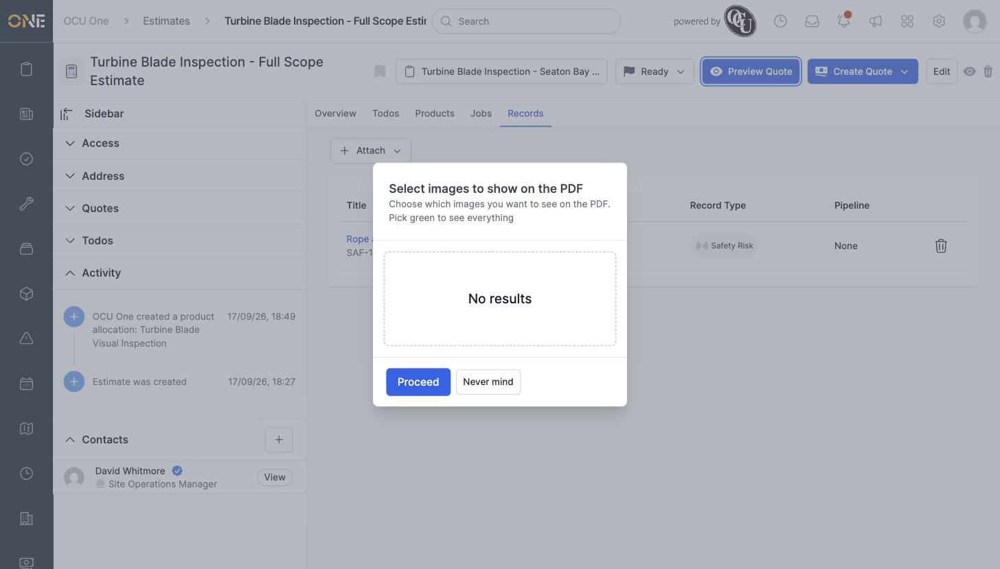
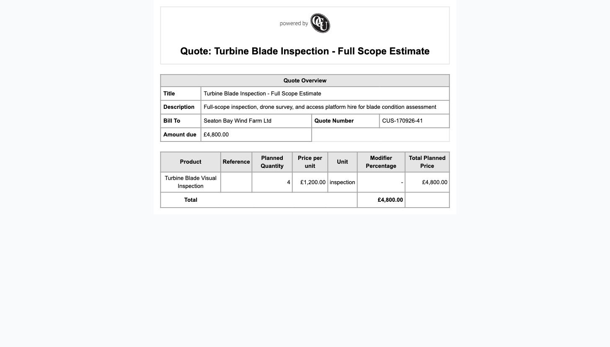
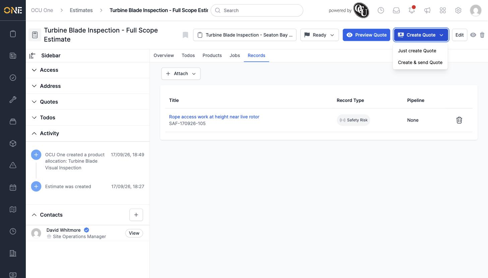
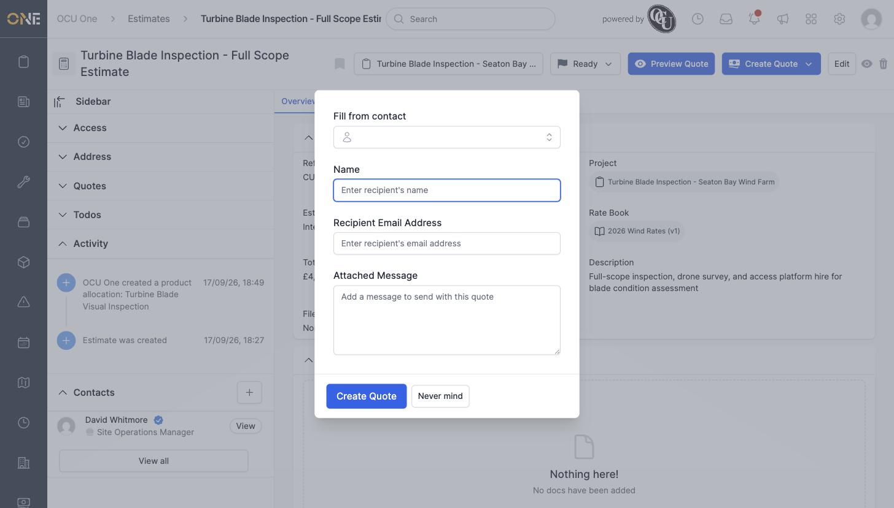
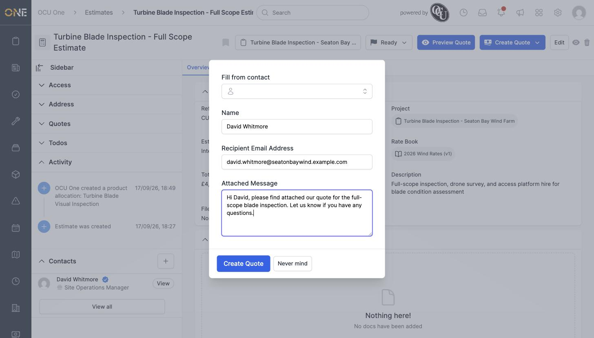
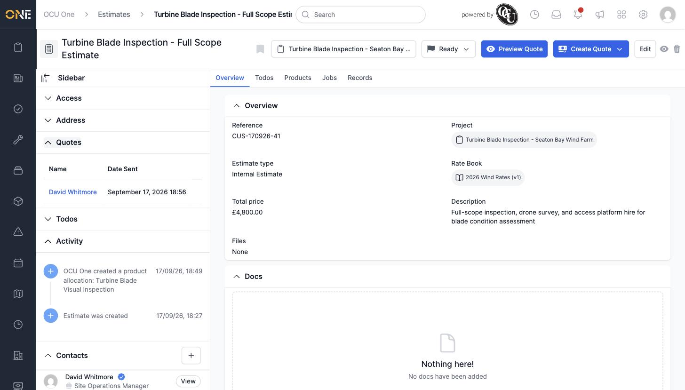

# Creating and sending a quote (PDF) to a client

Once an estimate is scoped out, you can turn it into a quote — a PDF summarising the work and price — to send to a client, or just generate it for your own records.

## Previewing the quote first

Before creating anything, click **Preview Quote** on the estimate's overview page. You'll be asked which images (from attachments/documents) to include:

Click **Proceed** to see the quote rendered as a webpage, showing the quote overview (title, description, who it's billed to, quote number, amount due) and a breakdown of every allocated product with its quantity, price, and total.

This preview is only available once the estimate has status **Ready**.

## Creating a quote

Click **Create Quote** (also only available at Ready) for two options:

- **Just create Quote** — generates the PDF for your own records, without emailing anyone.
- **Create & send Quote** — generates the PDF and emails it to a recipient.

Either option first asks you to pick which images to include, the same as Preview.

## Sending a quote to a client

Choosing **Create & send Quote** then shows a form:

Use **Fill from contact** to pull in the details of a contact already added to the estimate, or type the recipient's **Name** and **Recipient Email Address** directly. Add an **Attached Message** to go with it.

Click **Create Quote** to send it.

**Worth knowing:** in this environment, generating the actual PDF file crashed with a server error (the PDF-rendering step depends on a working headless-Chrome install that isn't set up here) — but the Quote record itself was still created and shows in the estimate's **Quotes** sidebar card with the recipient's name and the date sent, so the underlying send still went through even though the PDF attachment failed to build.

Click a quote's name in that list to open it and see its own detail page.
