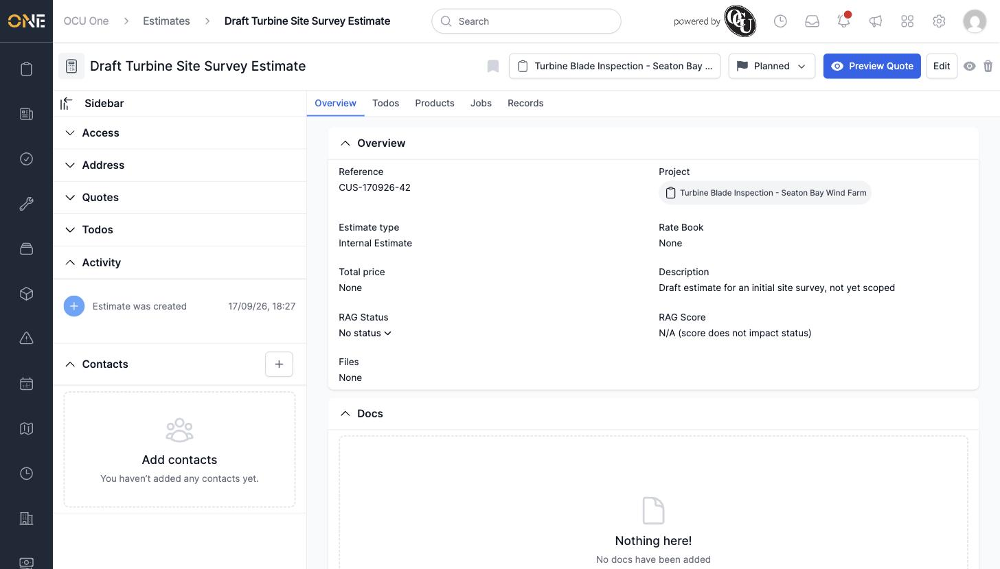
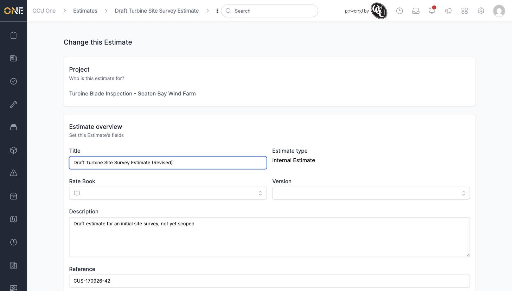
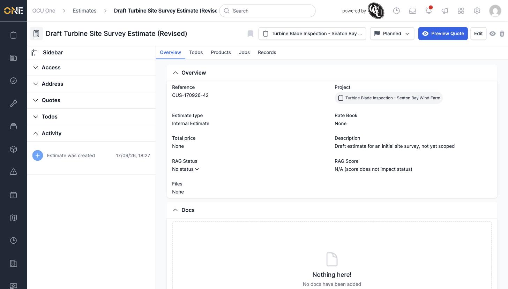
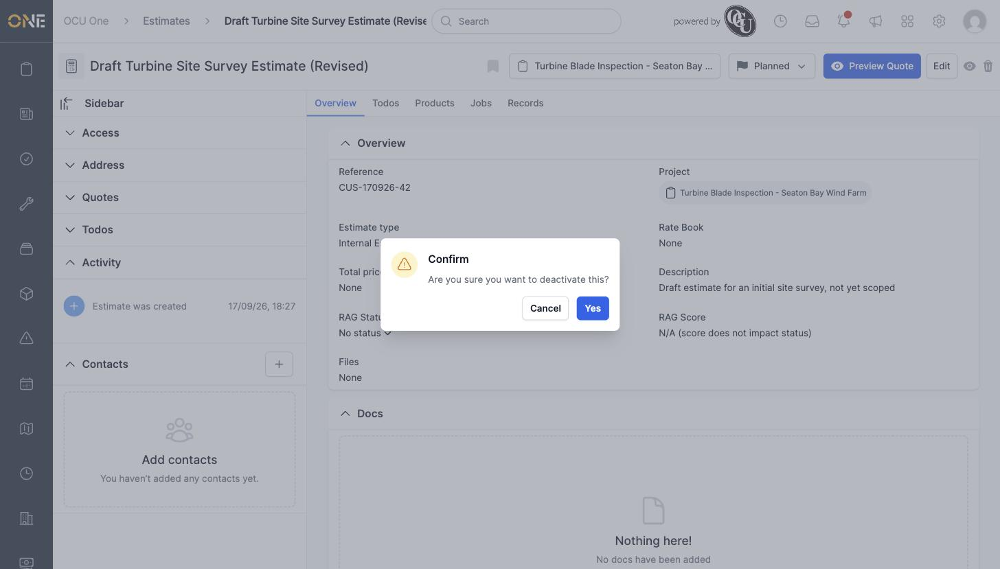
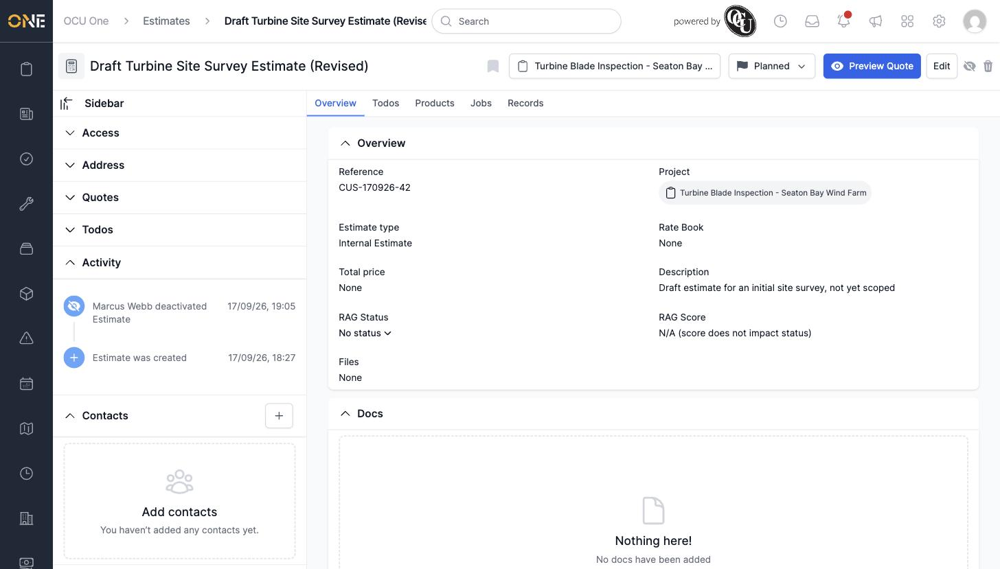
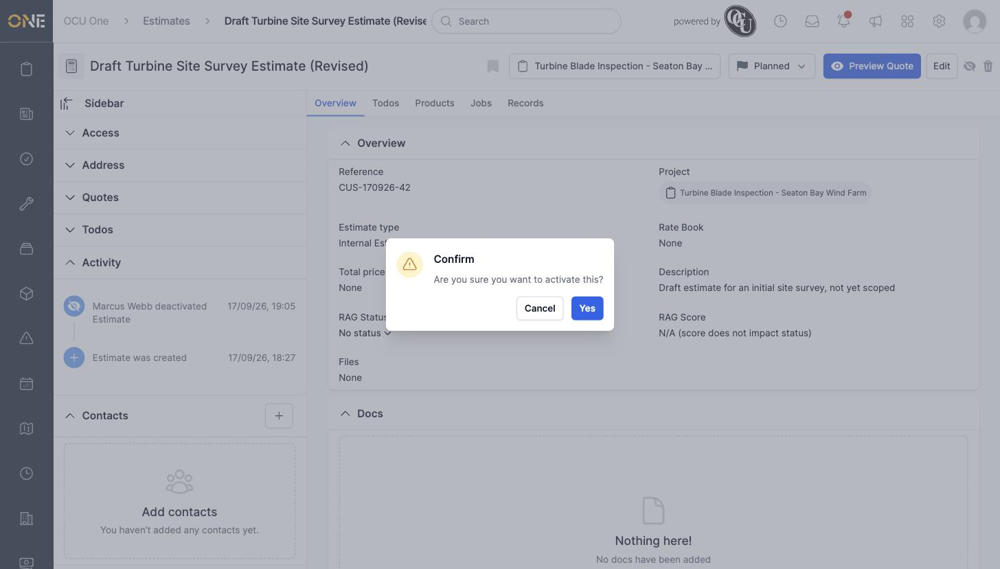
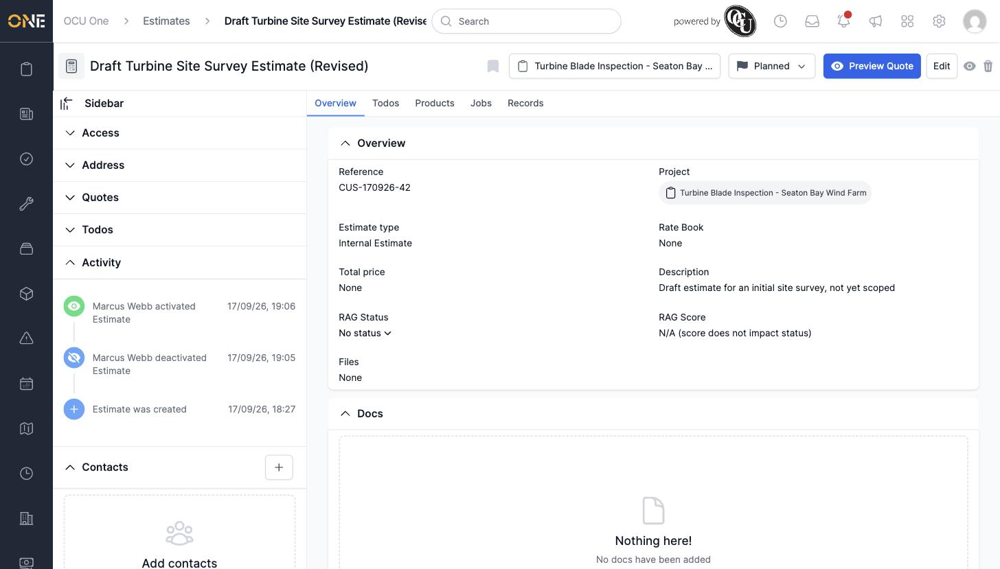
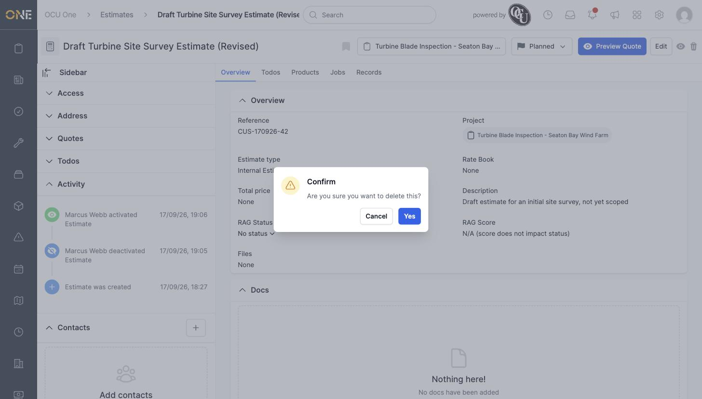

# Editing, activating/deactivating, or deleting an estimate

Draft estimates — Unsent, Planned, or Ready — can be edited or deleted freely. Once Pending or further along, they're locked from changes (see [Viewing an estimate overview and updating status/RAG](Viewing%20an%20estimate%20overview%20and%20updating%20status%20RAG.md)).

## Editing

Open an estimate and click **Edit** in the header.

Change any field — Title, Rate Book, Version, Description, Reference, Files — the same form used when creating it.

Click **Update Estimate** to save. The change appears immediately, including in the page title.

## Activating and deactivating

Click the eye icon in the header to deactivate an estimate — a confirmation dialog appears first.

Click **Yes** to confirm. The icon changes to a crossed-out eye, and the Activity feed records who deactivated it and when. Deactivating doesn't change the estimate's status (it stayed **Planned** here) — it's a separate lifecycle flag from the status workflow.

Click the crossed-out eye icon again to reactivate it, confirming the same way.

## Deleting

Click the trash icon in the header.

Click **Yes** to permanently delete the estimate — it's removed from the Estimates list immediately and can't be recovered. Deleting is only available while an estimate is unlocked; a Pending or later-stage estimate has no delete option.
