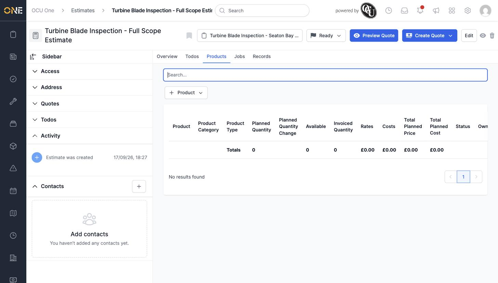

# Managing products/materials on an estimate

An estimate's **Products** tab is where you'd plan out the materials, parts, or other billable items the work needs, the same way you would on a job or project.

## Where to find it

Open an estimate and click its **Products** tab.

Clicking **+ Product** offers a choice of allocation type (for example "Default" or "Planned Works", depending on what your tenant has set up).

## Adding a product currently doesn't work

Choosing an allocation type from that dropdown crashes with a server error instead of opening the product picker — nothing gets added, and the tab is left unusable for adding new products. This is a real app bug, not expected behaviour; see [Adding a product to an estimate crashes with "Template is missing"](../Zz%20-%20Known%20Bugs/adding-a-product-to-an-estimate-crashes-with-template-is-missing.md) for the full write-up. The same "+ Product" flow works correctly on a job's Products tab, so this appears specific to estimates.

Once this is fixed, products already on the estimate would show in the table with their planned quantity, available amount, rates, costs, and totals — same as the equivalent tab on a job or project.
