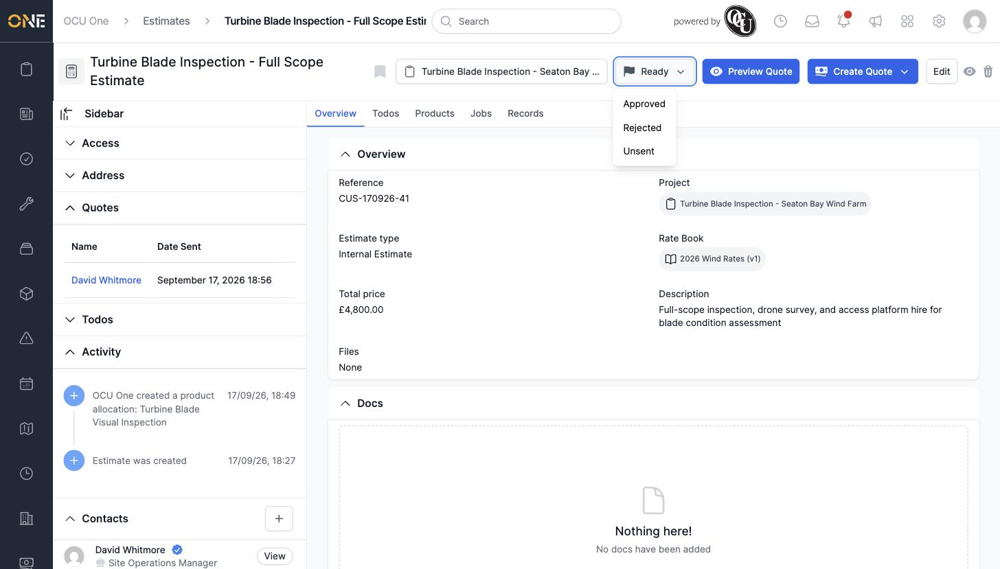
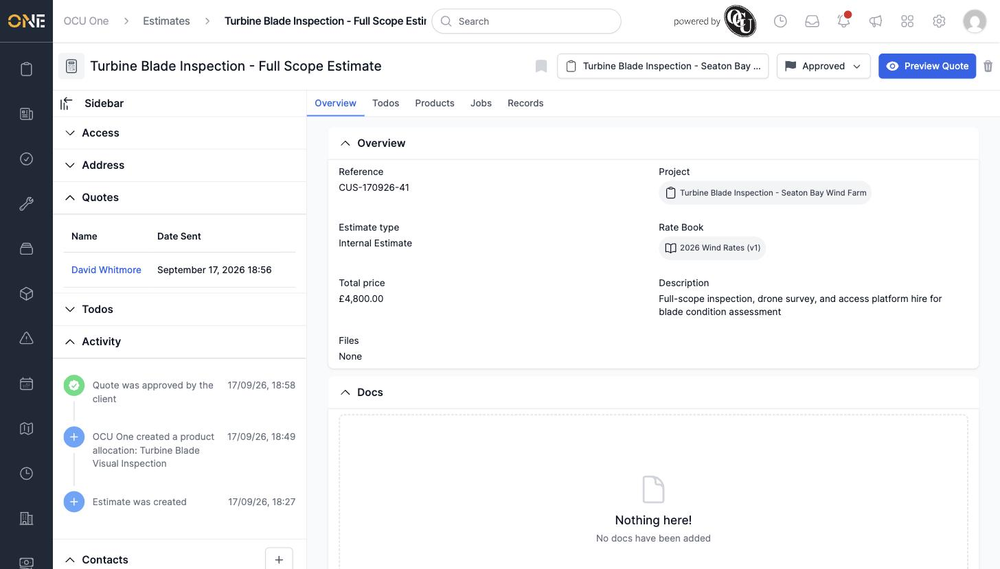
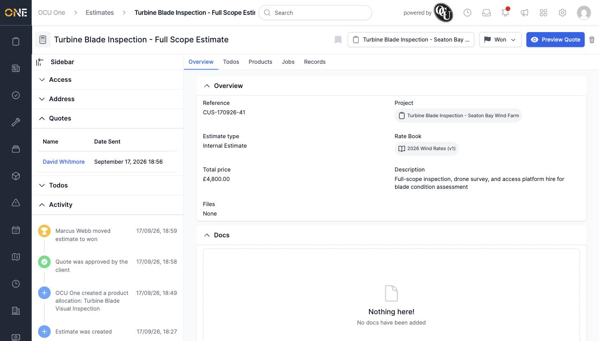
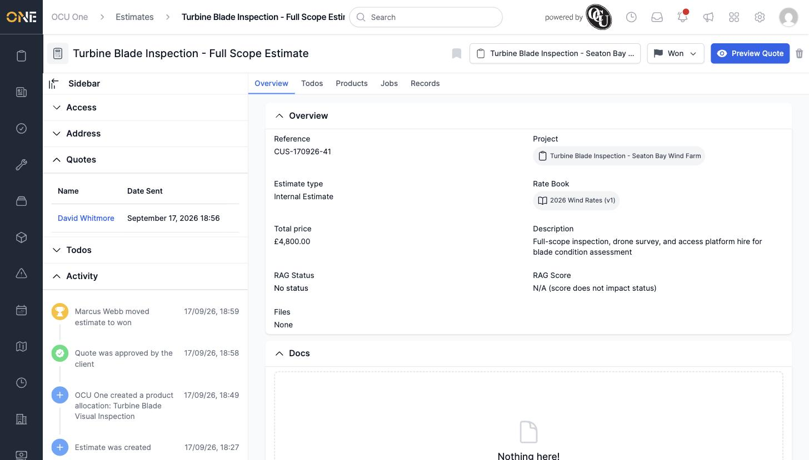
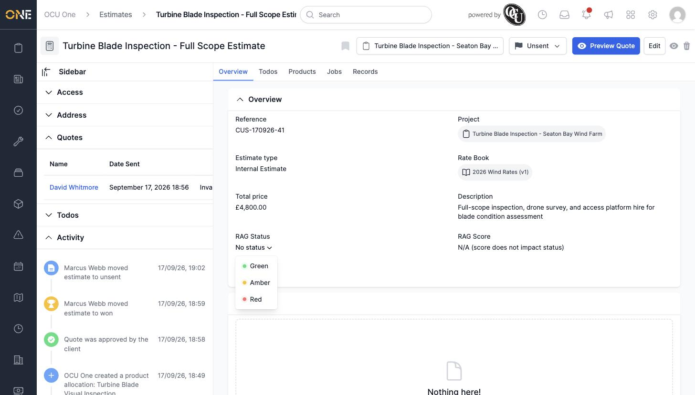
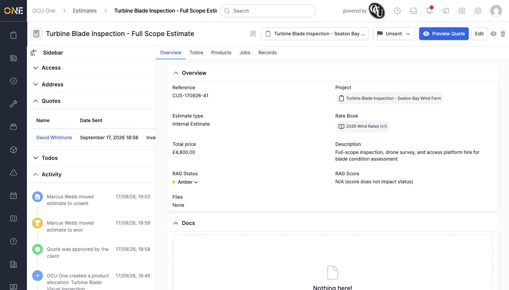

# Viewing an estimate overview and updating status/RAG

An estimate's Overview tab is the first thing you see when you open it — its reference, project, type, rate book, total price, and description — alongside a Status control (and, on estimate types that use RAG, a RAG Status/Score pair) in the page header.

## Reading the overview

The Overview card shows the estimate's **Reference** (auto-generated unless you set one), **Project**, **Estimate type**, **Rate Book**, **Total price** (calculated from allocated products), and **Description**.

## Changing status

Click the status badge in the header (shown as **Ready**, **Approved**, **Won**, etc.) to see the statuses you can move to from here — only valid next steps are offered, not the full list.

Picking **Approved** moves it there immediately — no confirmation step — and records the change in the Activity feed. Once Approved, editing and deleting are no longer available (the **Edit** and delete buttons disappear), and the **Create Quote**/**Preview Quote** buttons are replaced with just **Preview Quote**.

From Approved, the only next steps are **Won** or back to **Unsent**. Moving to Won logs who moved it and when in the Activity feed.

Statuses generally only move forward or back to Unsent — for example Won can only go to Unsent or Archived, not directly to any other status.

## Updating RAG status

On an estimate type configured for manual RAG, a **RAG Status** field (and a **RAG Score**, shown as "N/A" when the score doesn't factor into status) appears on the Overview card alongside the estimate's other fields.

Click **No status** to open the RAG picker:

Pick a colour to set it.

**Worth knowing:** RAG status can only be changed while the estimate is unlocked (Unsent, Planned, or Ready) — once it's Approved or further along, the RAG field is no longer clickable.
