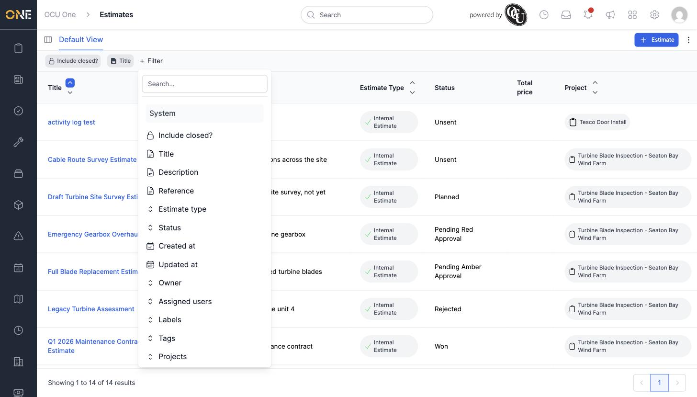
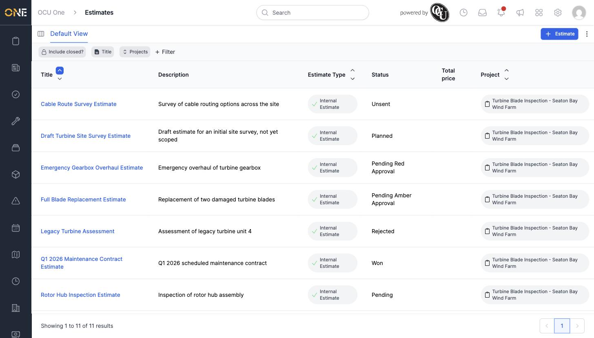
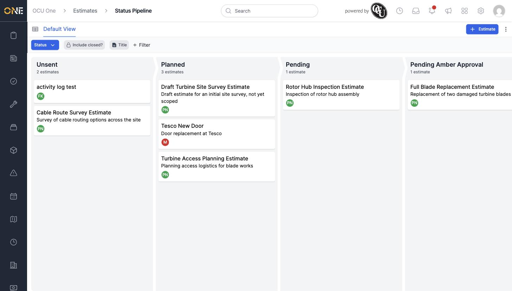
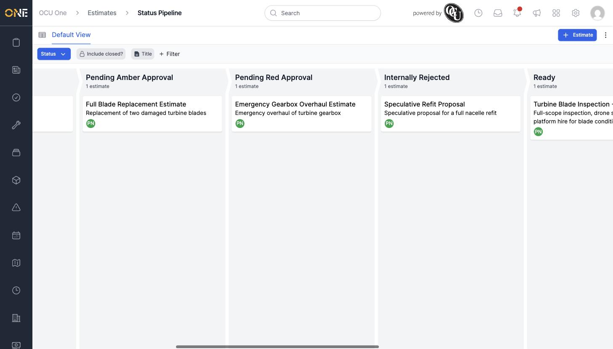

# Viewing and filtering estimates and the estimates pipeline

The Estimates list shows every estimate you have access to, either as a table or as a status pipeline (kanban) board. Both views support the same filters, so you can narrow either one down to just the estimates you're interested in.

## The table view

Open **Estimates** from the sidebar to see the default table. Each row shows the estimate's title, description, estimate type, status, total price, and the project it belongs to.

*Click "+ Filter" to add a filter on any of these fields.*

Click **+ Filter**, choose a field — for example **Projects** — pick a condition like "contains", and enter or select a value. Click **Update** to apply it. The filter appears as a chip next to "+ Filter" so you can see (and remove) it later.

*Filtering by Project narrows the table down to just that project's estimates.*

Click any column header (Title, Estimate Type, Project) to sort by it — the arrows next to the header show the current sort direction. There's also an **Include closed?** toggle that, when turned on, includes estimates whose project has been closed.

Click any estimate's title to open its overview page.

## The pipeline (board) view

Click the small board icon at the top left, next to "Default View", to switch to the **Status Pipeline** — one column per estimate status, scrolling horizontally: Unsent, Planned, Pending, Pending Amber Approval, Pending Red Approval, Internally Rejected, Ready, Approved, Rejected, Won, and Archived.

*Each column header shows how many estimates are in that status. Each card shows the estimate's title, description, and owner.*

Scroll right to see the later-stage columns:

The same **Include closed?**, sort, and **+ Filter** controls from the table view are also available on the board — apply them here to narrow the board down the same way. If your tenant has set up custom pipelines for estimates, a dropdown next to the board (labelled "Status" by default) lets you switch between them; otherwise the Status pipeline is the only option. Click **View as table** (shown where "Default View" appears on the table) to switch back.

Click any card to open that estimate's overview page.
