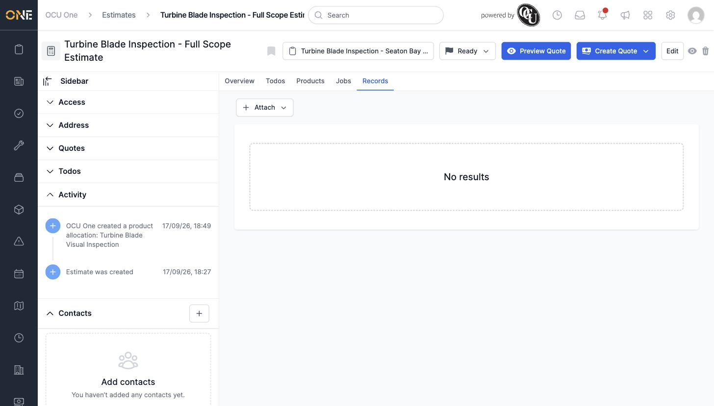
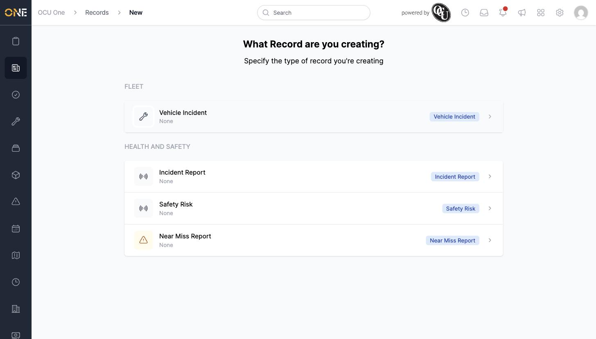
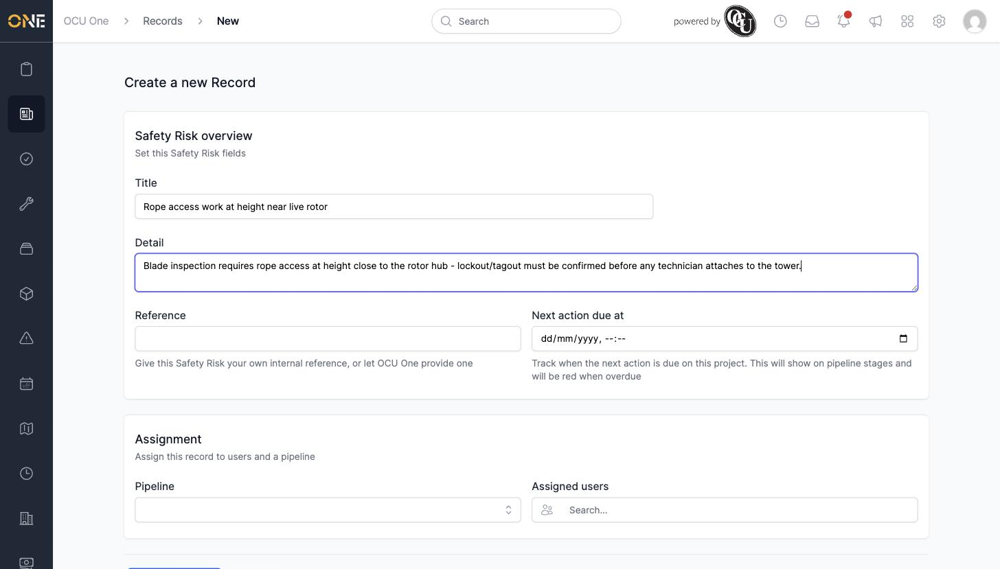
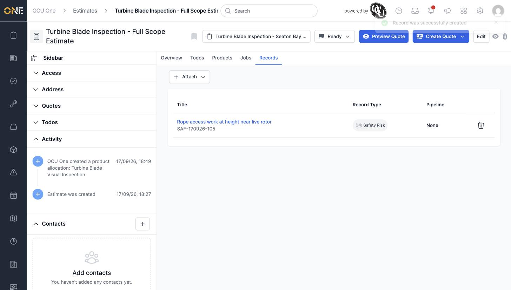

# Viewing records attached to an estimate

Records — safety risks, incident reports, near miss reports, and any other record types your tenant has configured — can be linked to an estimate for reference.

## Where to find it

Open an estimate and click its **Records** tab. If nothing's attached, you'll see an empty state with a **+ Attach** button.

## Attaching a record

Click **+ Attach**, then choose **New** to create one from scratch or **Existing** to link one that already exists. Choosing **New** shows the record types available to attach to an estimate:

Pick a type and fill in its fields — Title and Detail are always present, along with an optional Reference, a "Next action due at" date, and assignment fields (Pipeline, Assigned users).

Click **Create Record** to save it.

## Viewing attached records

Once attached, the Records tab lists each one's title, record type, and pipeline (if it's on one). Click a record's title to open it.

Click the trash icon on a row to detach a record from the estimate — this only removes the link, it doesn't delete the record itself.
