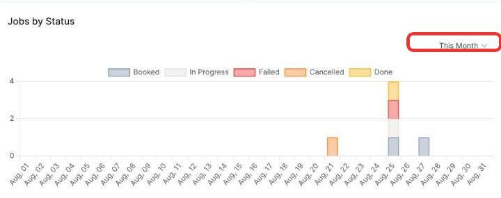
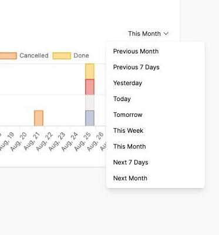

# Filtering the Jobs by Status chart

The **Jobs by Status** chart shows how many jobs were scheduled each day over a period, broken down by status (Booked, In Progress, Failed, Cancelled, Done).

1. Click the time period in the top right (defaults to **This Month**).

   

2. Choose a different period from the list.

   

The chart updates to show that period, with each day's bar split into coloured segments by status — hover over a segment to see the exact count.
