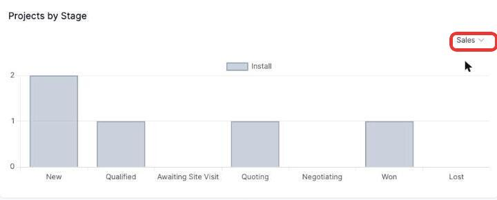
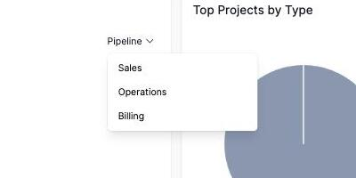

# Filtering the Projects by Stage chart

The **Projects by Stage** chart shows how many projects sit in each stage of a pipeline, broken down by project type.

1. Click the pipeline name in the top right.

   

2. Choose a pipeline from the list — the pipelines available depend on how your organisation has set them up.

   

The chart updates to show that pipeline's stages along the bottom, with each bar split by project type — hover over a segment to see the exact count. If a pipeline has no projects in it, the chart shows "No data" instead.
