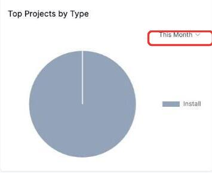

# Filtering the Projects by Type chart

The **Top Projects by Type** chart shows the split of your projects by project type, as a pie chart, over a period.

1. Click the time period in the top right (defaults to **This Month**).

   

2. Choose a different period from the list.

   

Unlike the stage chart, this one goes by when the project was created, not by any scheduled dates.
