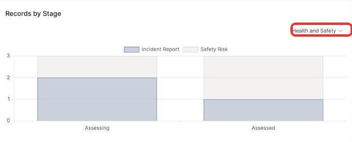

# Filtering the Records by Stage chart

The **Records by Stage** chart shows how many records sit in each stage of a pipeline, broken down by record type.

1. Click the pipeline name in the top right (defaults to the first pipeline you have access to).

   

2. Choose a pipeline from the list — if your organisation only has one records pipeline set up, that'll be the only option.

The chart updates to show that pipeline's stages along the bottom, with each bar split by record type — hover over a segment to see the exact count.
