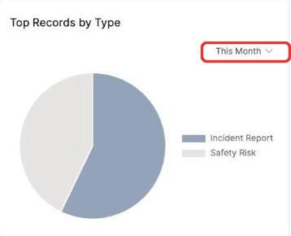

# Filtering the Records by Type chart

The **Top Records by Type** chart shows the split of your records by record type, as a pie chart, over a period.

1. Click the time period in the top right (defaults to **This Month**).

   

2. Choose a different period from the list.

   

The pie chart updates to show the proportion of each record type created in that period — hover over a slice to see its name and count.
