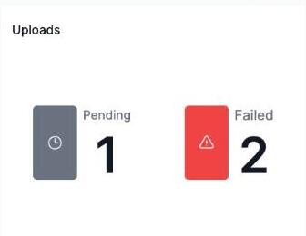

# Monitoring the Uploads status widget (Admin)

The **Uploads** widget on the Home > Overview dashboard shows two counts: **Pending** and **Failed** uploads — data being sent up from the mobile app that hasn't yet finished processing, or has errored out.

This widget is restricted to OCU's own internal platform team, not tenant administrators — no customer account, including Admin accounts, can see it. If you're on OCU's platform team and need more detail on what these counts mean or how to act on them, refer to internal documentation rather than this guide.
