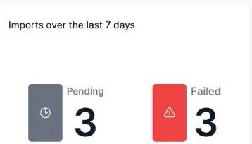

# Monitoring the Weekly Imports status widget (Admin)

The **Imports over the last 7 days** widget gives administrators a quick health check on recent data imports.

It shows two counts, covering imports started in the last 7 days:

- **Pending** — imports that haven't finished processing yet
- **Failed** — imports that errored out

If **Failed** is non-zero, it's worth checking the import in question — see the separate guide on importing data via CSV for how to review and re-run one. This widget only appears if you have permission to create imports.
