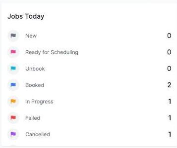

# Reading the Jobs Today widget

The **Jobs Today** widget shows how many jobs had a status change today, broken down by status.

The statuses shown are:

- **New**
- **Ready for Scheduling**
- **Unbook**
- **Booked**
- **In Progress**
- **Failed**
- **Cancelled**

A job counts toward a status here if it changed to that status today — so a job that's been sitting as Booked since last week won't show up, but one that was just booked today will. This widget only appears if you have permission to view jobs.
