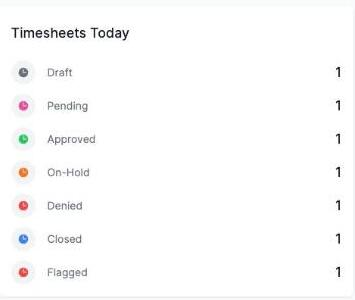

# Reading the Timesheets Today widget

The **Timesheets Today** widget shows how many of today's timesheets currently sit in each status.

The statuses shown are:

- **Draft** — not yet submitted
- **Pending** — submitted and awaiting review
- **Approved** — reviewed and approved
- **On-Hold** — paused partway through review
- **Denied** — reviewed and rejected
- **Closed** — finalised
- **Flagged** — marked for attention during review

A timesheet counts as "today's" if any part of its shift falls on today's date, not just timesheets created today. This widget only appears if you have permission to view timesheets.
