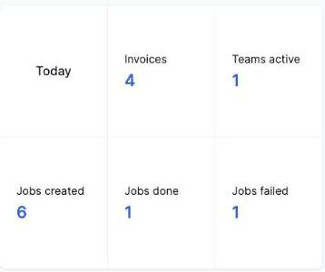

# Reading the Today snapshot widget

The **Today** widget, at the top left of the Home > Overview dashboard, gives you a quick count of what's happened so far today.

It shows:

- **Invoices** — how many invoices have been created today
- **Teams active** — how many field team members have been active on a mobile device today
- **Jobs created** — how many jobs have been created today
- **Jobs done** — how many jobs have been marked Done today
- **Jobs failed** — how many jobs have been marked Failed today

This widget is a live snapshot — it resets at the start of each day and only ever reflects today's activity.
