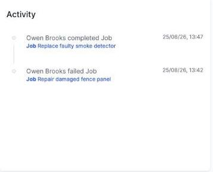

# Reviewing the Recent Activity widget

The **Activity** widget shows a short timeline of the most recent actions you've personally taken in OCU One.

Each entry shows what you did, a link to the record it relates to, and exactly when it happened. This widget only shows your own activity — not your team's or your organisation's — so it's a quick way to check what you've actually done recently without digging through individual records.
