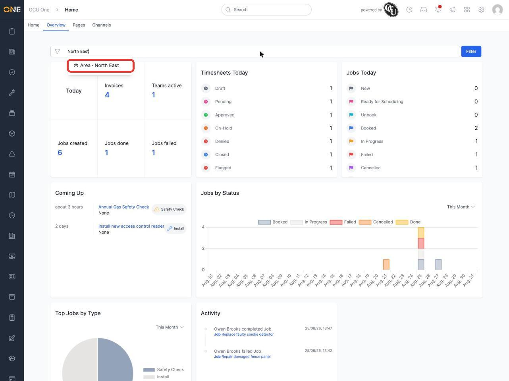

# Using the Home overview widget dashboard

The **Overview** tab (next to **Home** at the top of the Home page) shows a dashboard of widgets: snapshots and charts covering your jobs, timesheets, projects, records, and more. Each widget is covered in its own guide — this one covers the tag filter that sits above all of them.

1. Click into the search box and start typing the name of a tag.

2. Choose a matching tag from the suggestions.

   

3. Click **Filter**.

This narrows every widget on the dashboard down to only the jobs, timesheets, projects, and records that carry that tag — useful for focusing on a specific region, team, or category rather than your whole organisation's activity.

Only tags that are set up on your own account are offered here, so if you can't find the tag you're after, check with your administrator.
