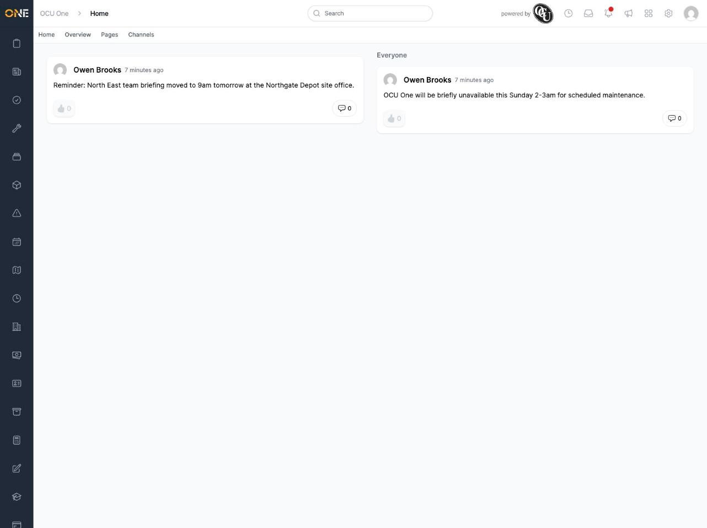

# Viewing your activity feed

The **Home** tab is the default page you land on when you open OCU One (unless you've set a different default home page — see the guide on updating your account profile). It shows two feeds side by side: posts from channels you're part of, and posts sent to everyone in your organisation.

- The feed on the left shows posts from the Hub channels you belong to.
- The **Everyone** feed on the right shows posts sent to the whole organisation, regardless of which channels you're in.

Each post shows who posted it and how long ago, along with a like button and a comment count. Posts here come from the Hub — see the separate guides on Hub channels and pages for how they're created.

If you haven't been added to any channels yet, or nobody's posted recently, these feeds will simply be empty.
