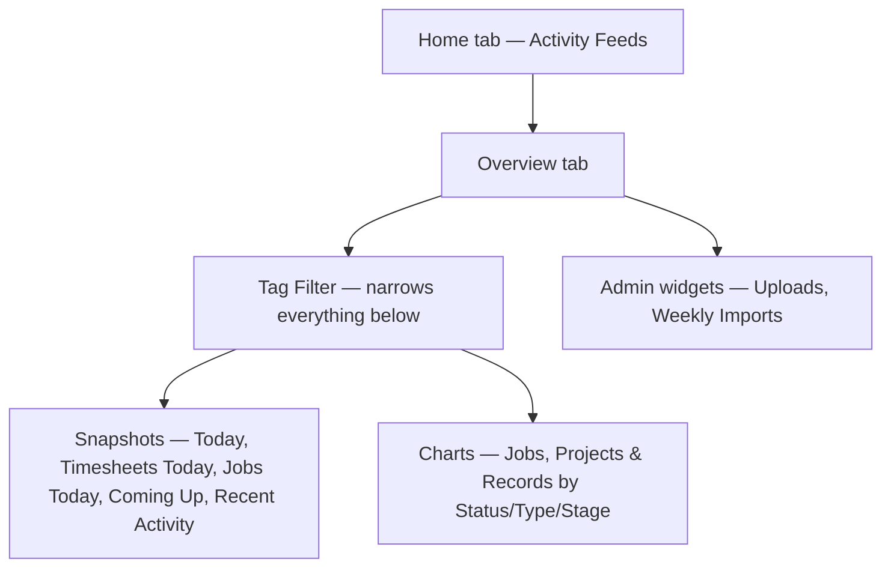

# Home Dashboard — Overview

The **Home** page is the first thing you see when you open OCU One. It's split into two tabs — **Home** and **Overview** — that together give you a feed of what's being shared across the organisation and a dashboard of at-a-glance numbers for your own work. This guide explains how the two tabs fit together, before you dive into the detailed guides for each widget.

## The core pieces

The **Home** tab shows two activity feeds side by side: posts from the Hub channels you belong to, and an **Everyone** feed of posts sent to the whole organisation.

The **Overview** tab shows a dashboard of independent **widgets** — small panels that each summarise one slice of your data: counts for today, upcoming jobs, your own recent activity, and charts you can filter by time period or pipeline. A shared **tag filter** sits above all of them and can narrow every widget at once.

A handful of widgets are restricted to **Admin** or OCU's own internal platform team, and only appear for accounts with the right permissions.

## Why this matters

The Home page exists so you don't have to go looking for the basics every day:

- **Staying in the loop** — the activity feeds surface what your organisation and your channels are posting, without you having to visit the Hub directly.
- **A quick health check** — the Overview widgets answer "what's happened today" and "what's coming up" at a glance, without opening individual lists.
- **Focusing the picture** — the tag filter and each chart's own period/pipeline controls let you narrow the numbers down to a region, team, or timeframe that matters to you, rather than your whole organisation's activity.

## The end-to-end flow

Start on the **Home** tab to see what's being shared — see [Viewing your activity feed](Viewing%20your%20activity%20feed.md).

Switch to the **Overview** tab for the widget dashboard. [Using the Home overview widget dashboard](Using%20the%20Home%20overview%20widget%20dashboard.md) covers the tag filter that sits above every widget and narrows them all down together.

The widgets themselves fall into a few natural groups. **Snapshots** give you a running count of today's activity and what's next: [Reading the Today snapshot widget](Reading%20the%20Today%20snapshot%20widget.md), [Reading the Timesheets Today widget](Reading%20the%20Timesheets%20Today%20widget.md), [Reading the Jobs Today widget](Reading%20the%20Jobs%20Today%20widget.md), and [Browsing upcoming jobs on the Coming Up widget](Browsing%20upcoming%20jobs%20on%20the%20Coming%20Up%20widget.md), plus [Reviewing the Recent Activity widget](Reviewing%20the%20Recent%20Activity%20widget.md) for a timeline of your own recent actions.

**Charts** cover the same handful of controls — a time period or pipeline picker, then a bar or pie chart that updates to match: [Filtering the Jobs by Status chart](Filtering%20the%20Jobs%20by%20Status%20chart.md), [Filtering the Jobs by Type chart](Filtering%20the%20Jobs%20by%20Type%20chart.md), [Filtering the Projects by Stage chart](Filtering%20the%20Projects%20by%20Stage%20chart.md), [Filtering the Projects by Type chart](Filtering%20the%20Projects%20by%20Type%20chart.md), [Filtering the Records by Stage chart](Filtering%20the%20Records%20by%20Stage%20chart.md), and [Filtering the Records by Type chart](Filtering%20the%20Records%20by%20Type%20chart.md).

Finally, two **Admin** widgets give a health check on data flowing into the system: [Monitoring the Uploads status widget (Admin)](Monitoring%20the%20Uploads%20status%20widget%20%28Admin%29.md) (OCU-internal only) and [Monitoring the Weekly Imports status widget (Admin)](Monitoring%20the%20Weekly%20Imports%20status%20widget%20%28Admin%29.md).

## The widgets at a glance

- **Home tab** — the two activity feeds (personal and Everyone).
- **Tag Filter** — one filter on the Overview tab that narrows every snapshot and chart below it to a single tag.
- **Snapshots** — quick counts and short lists: today's totals, timesheet/job status breakdowns, upcoming jobs, and your own recent activity.
- **Charts** — the same jobs/projects/records data, broken down over a time period or pipeline, with its own filter control per chart.
- **Admin widgets** — only visible to Admin or OCU staff, covering the health of uploads and imports rather than day-to-day work.

Not every widget appears for every account — the Admin widgets in particular depend on your role — but whichever ones you do see all sit on the one Overview dashboard, filterable together via the tag filter above them.
