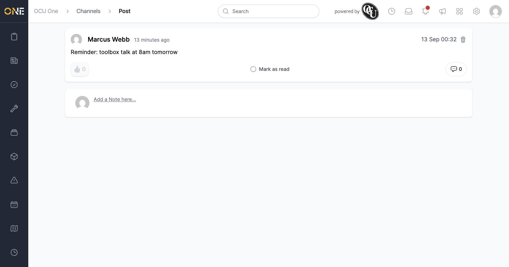
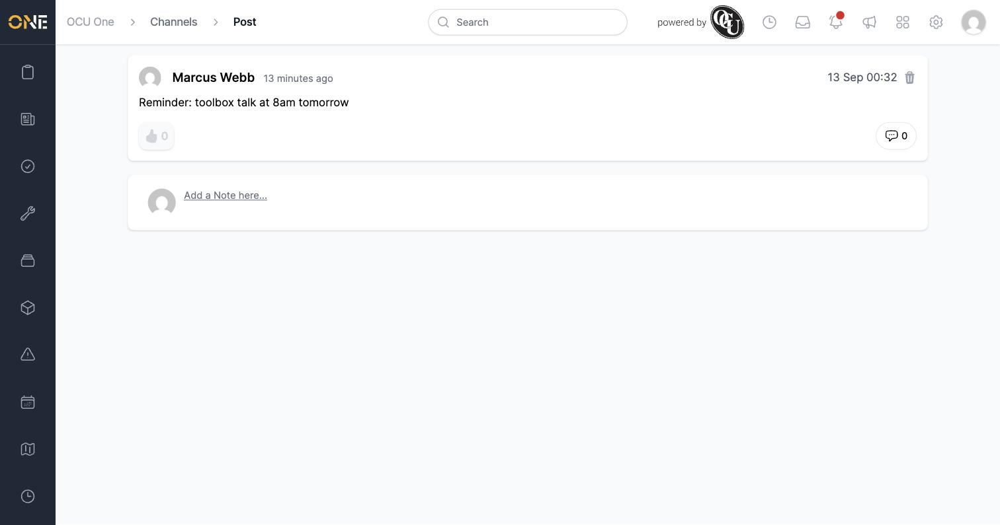
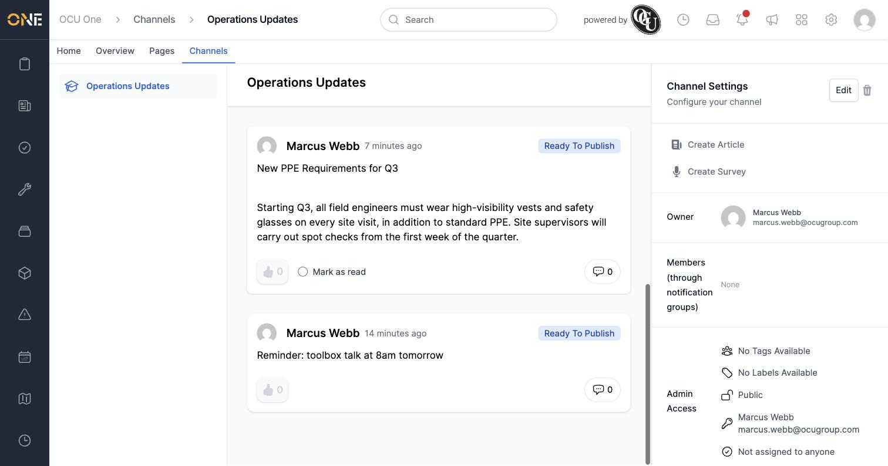

# Acknowledging (marking as read) a post or article

When a post or article is marked **Must Read** (with a deadline), everyone who can see it gets a **Mark as read** checkbox so they can confirm they've seen it.

## Acknowledging an item

Open the post or article. If it needs acknowledging, a **Mark as read** checkbox appears next to the thumbs-up reaction.

Click the checkbox. It disappears immediately — there's no separate save step or confirmation message.

Back in the channel's feed, anything you haven't yet acknowledged still shows its **Mark as read** checkbox, while items you've already acknowledged (or that don't need acknowledging) don't.

## Things to know

- Acknowledgment is per-user — everyone who can see the item needs to tick it individually; one person acknowledging doesn't cover anyone else.
- Only items with a **Must Read** deadline show the checkbox at all — most posts and articles don't need any acknowledgment.
- The item's owner is automatically counted as having acknowledged it as soon as the **Must Read** deadline is set, since they're assumed to have already seen their own content.
