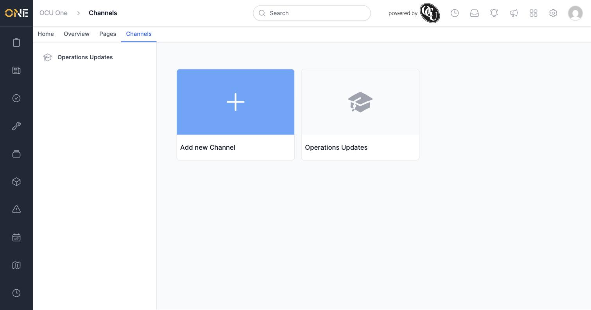
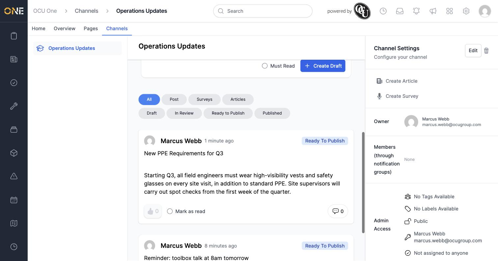
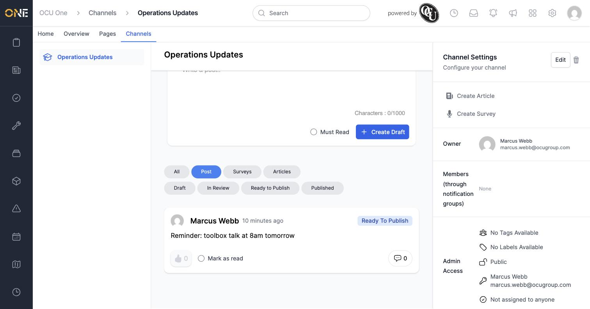

# Browsing Hub channels and viewing a channel's feed

**Channels** are topic-based feeds in the Hub — a place for a team or subject area to share posts, articles, and surveys. Every channel you have access to shows up as a tile on the **Channels** page.

## Browsing channels

Open **Channels** from the top navigation bar.

Click a channel's tile to open its feed.

## Viewing and filtering a channel's feed

A channel's page shows a composer at the top (for writing a new post) and its feed below, newest first. Filter chips along the top of the feed let you narrow what's shown:

- **All / Post / Surveys / Articles** — by content type.
- **Draft / In Review / Ready to Publish / Published** — by workflow status.

Click **Post** to show only posts, hiding articles and surveys from the same feed.

## Things to know

- You only see channels you have access to — a channel's owner controls this via its **Admin Access** setting (Private, or shared with specific people) in **Channel Settings**.
- Content and status filters can be combined — for example filtering to **Post** and **Draft** at the same time to find only your own unpublished posts.
- Clicking any item in the feed opens its own page, where you can read the full content and (if you have permission) move it through its review workflow — see *Writing and publishing a quick post in a channel* and *Writing and publishing a full article in a channel*.
