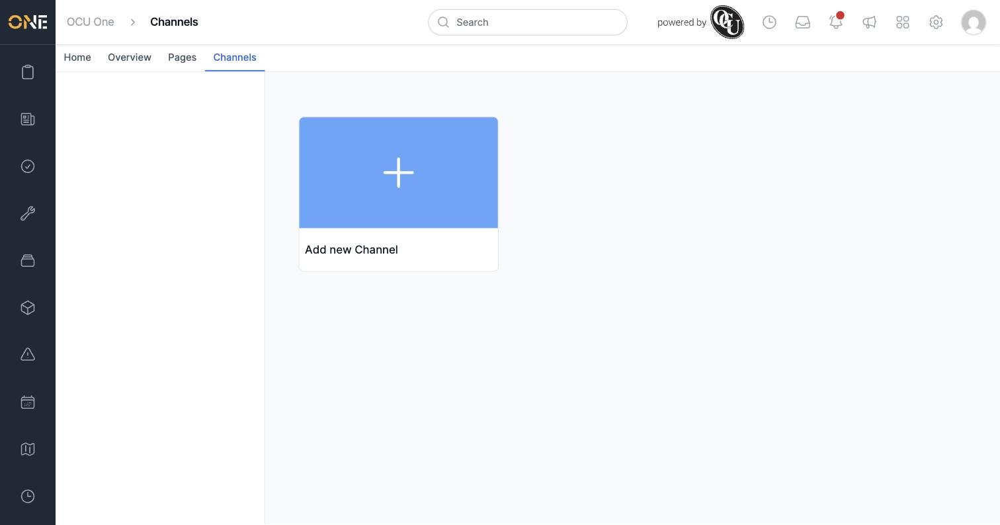
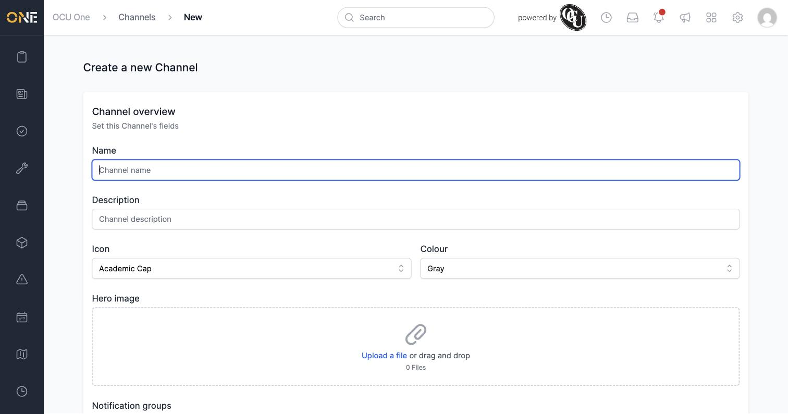
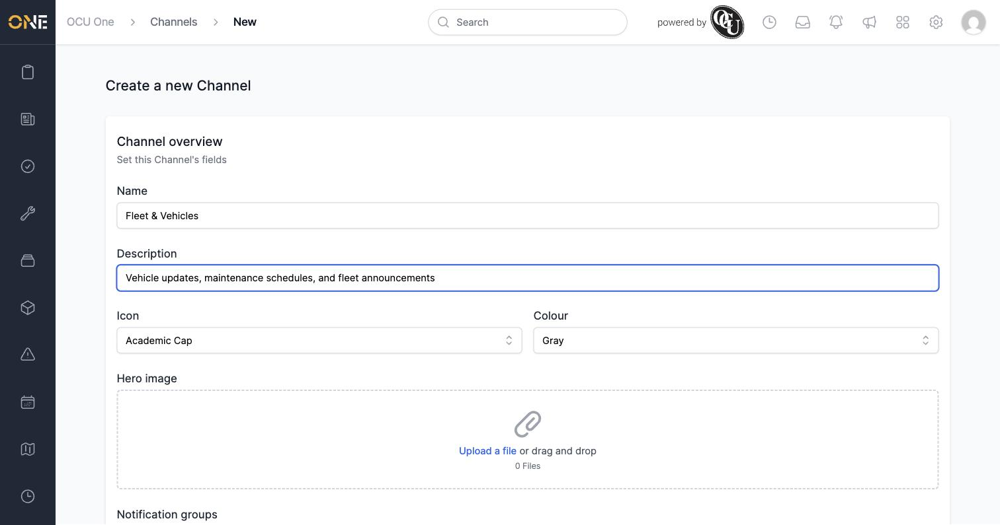
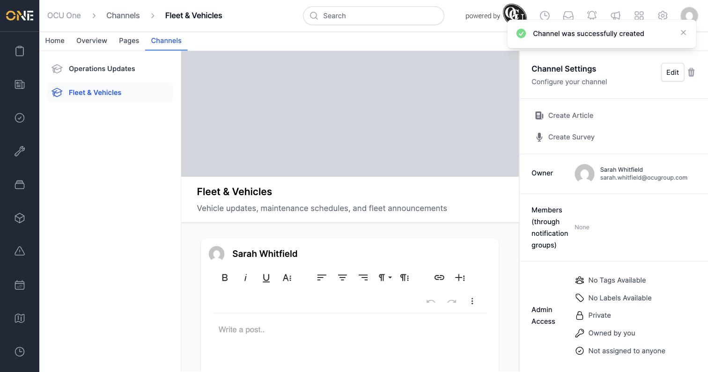
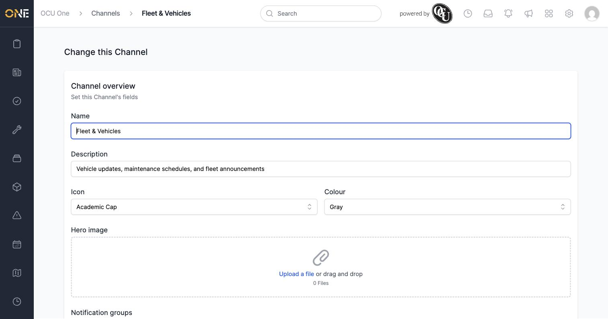
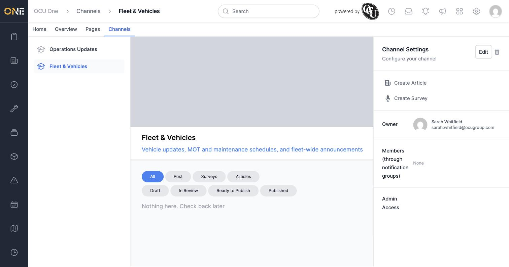

# Creating and configuring a Hub channel

Before anyone can post updates, articles, or surveys in the Hub, a **channel** needs to exist for them to go into.

## Creating a channel

Open **Channels** from the top navigation bar. If none exist yet, you'll just see an **Add new Channel** tile.

Click it to open the creation form:

Fill in:
- **Name** — e.g. **Fleet & Vehicles**.
- **Description** — a short summary shown under the channel's title.
- **Icon** and **Colour** — used for the channel's tile.
- **Hero image** — an optional banner image.
- **Notification groups** — who gets notified about new content in this channel.
- **Allow comments** — ticked on by default; turns commenting on or off for everything posted in this channel.

Click **Create Channel**.

## Editing a channel's settings

From the channel, click **Edit** in the **Channel Settings** panel to reopen the same fields.

Update whatever you need — here the description was reworded — and click **Update Channel** to save.

## Things to know

- Creating and editing channels requires the Hubs permission **Manage Channels**, granted through your role's permission set.
- A channel's **Admin Access** setting controls who can see it at all — **Private** by default, visible only to the owner and anyone it's explicitly shared with.
- The trash icon next to **Edit** archives the channel rather than deleting it outright — its content isn't lost, but the channel drops out of the main Channels list.
- Only one channel in the whole tenant can be marked as the **global channel** ("news channel") — setting a new one automatically unsets it on any other channel.
