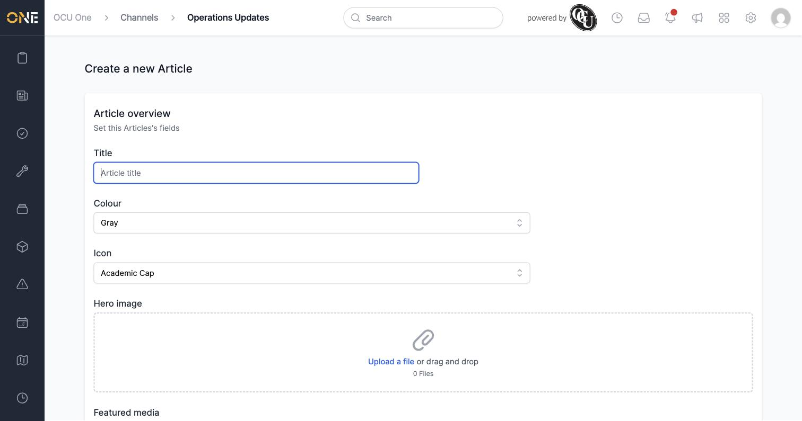
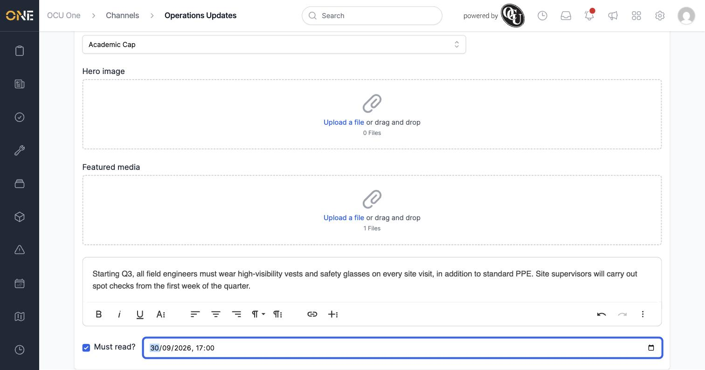
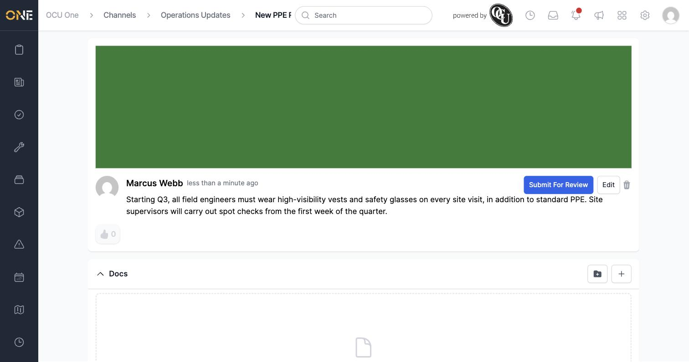
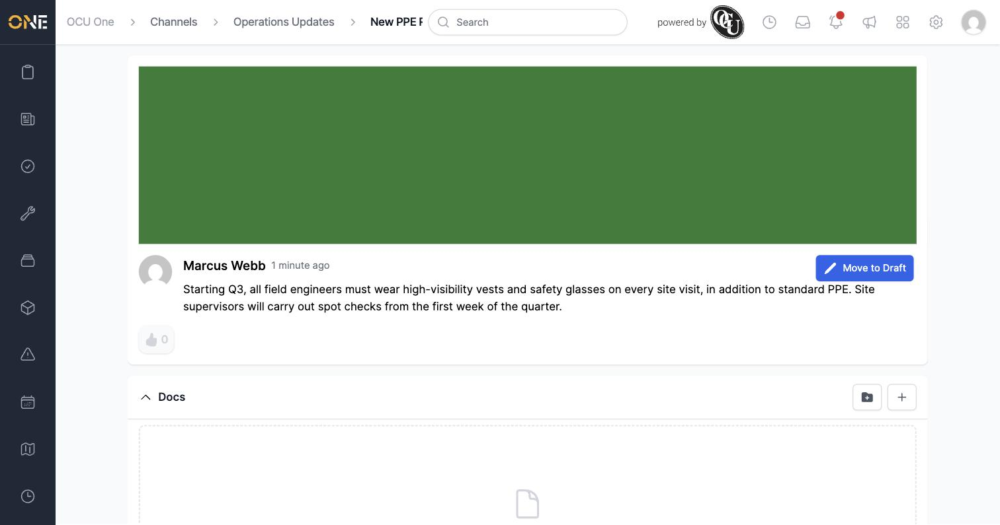
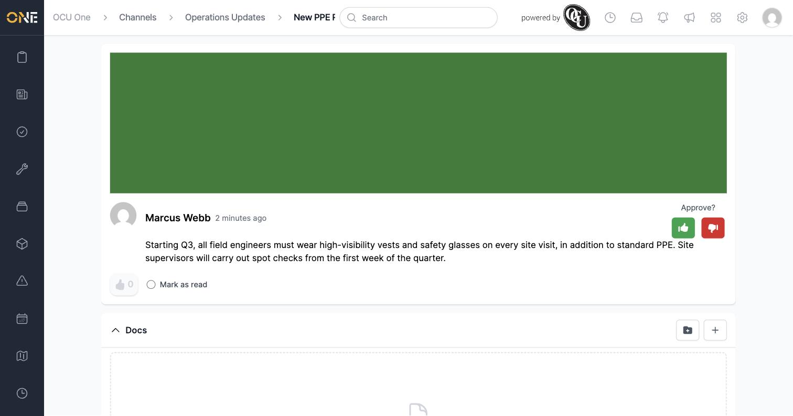
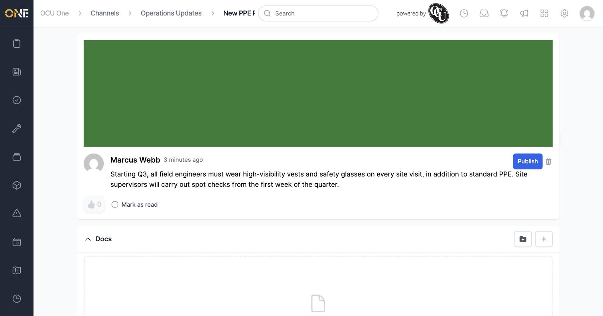
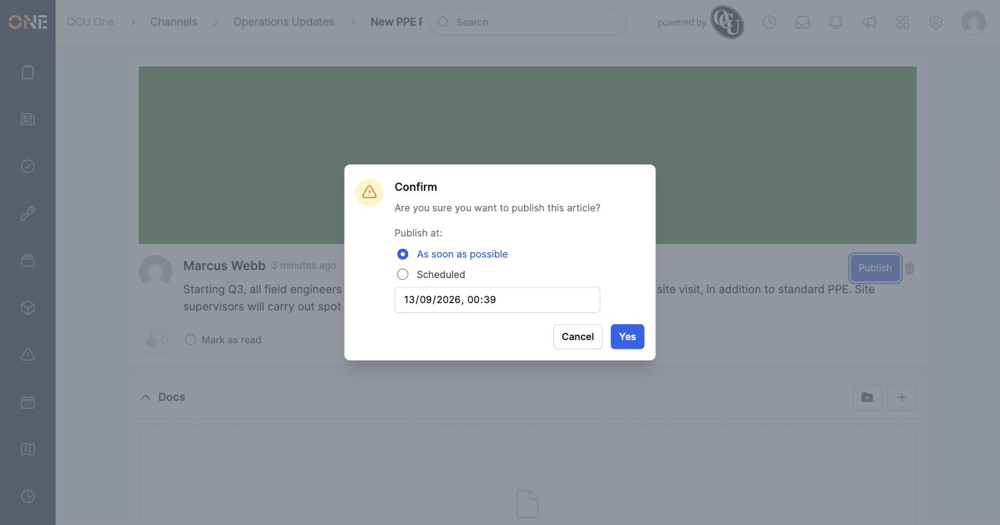
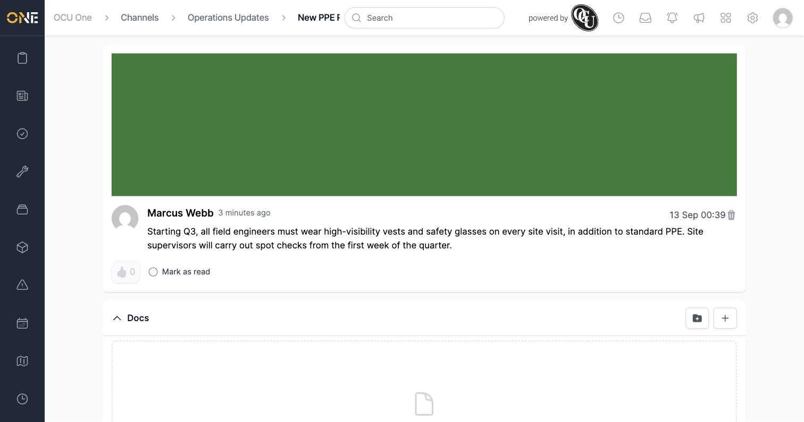

# Writing and publishing a full article in a channel

An **article** is a fuller piece of content than a quick post — it has its own title, a featured image, and richer formatting, making it better suited to things like policy announcements or longer updates.

## Creating an article

From the channel's **Channel Settings** panel, click **Create Article**.

Fill in:
- **Title** — e.g. **New PPE Requirements for Q3**.
- **Colour** and **Icon** — used for the article's tile.
- **Hero image** / **Featured media** — optional images; featured media shows as the banner on the article's own page and its feed card.
- The body content, using the same rich text editor as a post.
- **Must read?** — tick this if people need to formally acknowledge the article, which reveals a **Must read before** deadline field.

Click **Create Article**. It's created as a **Draft**, visible only to people who can manage the channel.

## Moving it through review and publishing

The workflow is identical to a post's:

1. Click **Submit For Review** and confirm. The owner's view then shows **Move to Draft** instead.

   

2. A different person with access to the channel sees an **Approve?** prompt (thumbs-up/down) and, if it needs acknowledging, a **Mark as read** option.

   

3. Approving moves it to **Ready to Publish**, showing a **Publish** button.

   

4. Click **Publish** and confirm, choosing **As soon as possible** or a **Scheduled** date and time.

   

Once published, the article shows its publish date instead of workflow buttons.

## Things to know

- The main difference from a post is the **Title**, **Hero image**, and **Featured media** fields — everything else (draft → review → approve → publish, and Must Read acknowledgment) works the same way.
- As with posts and pages, you can't approve or publish your own article — someone else with access needs to do that.
