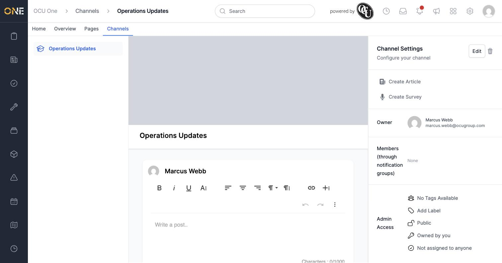
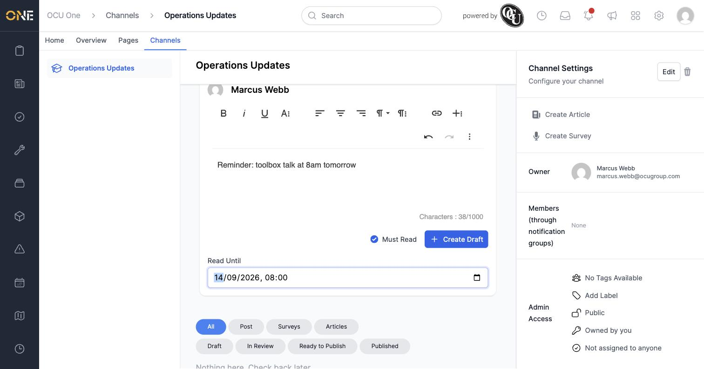
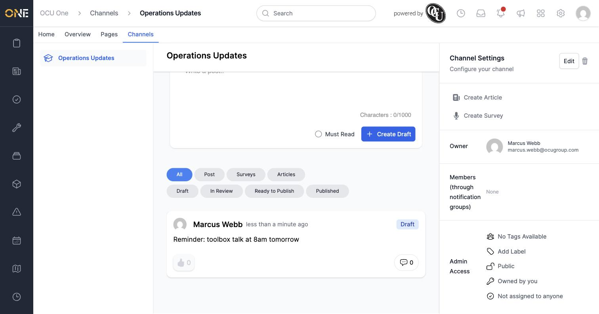
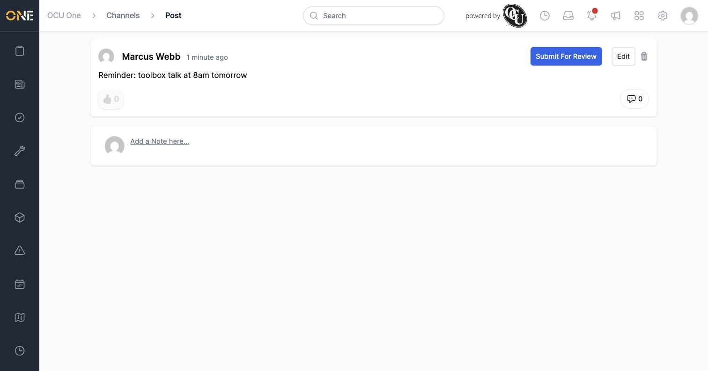
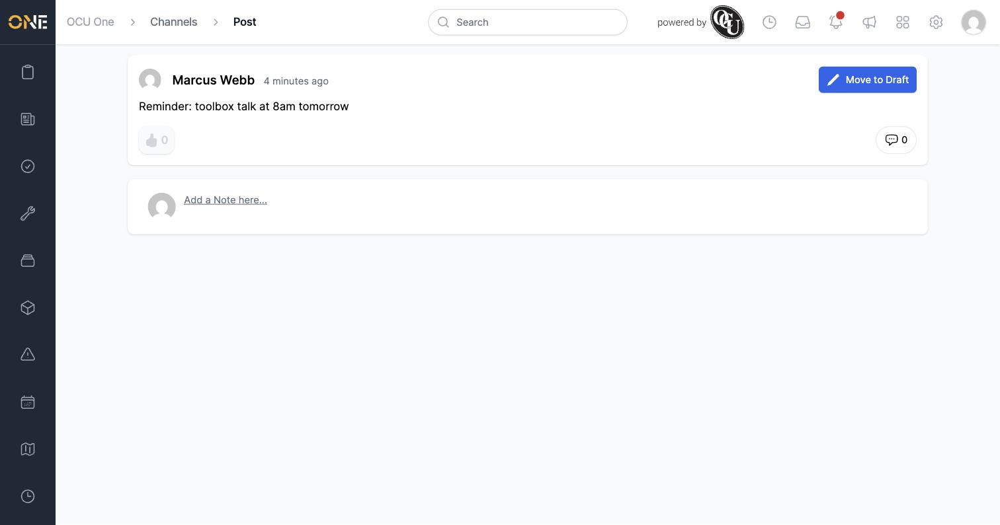
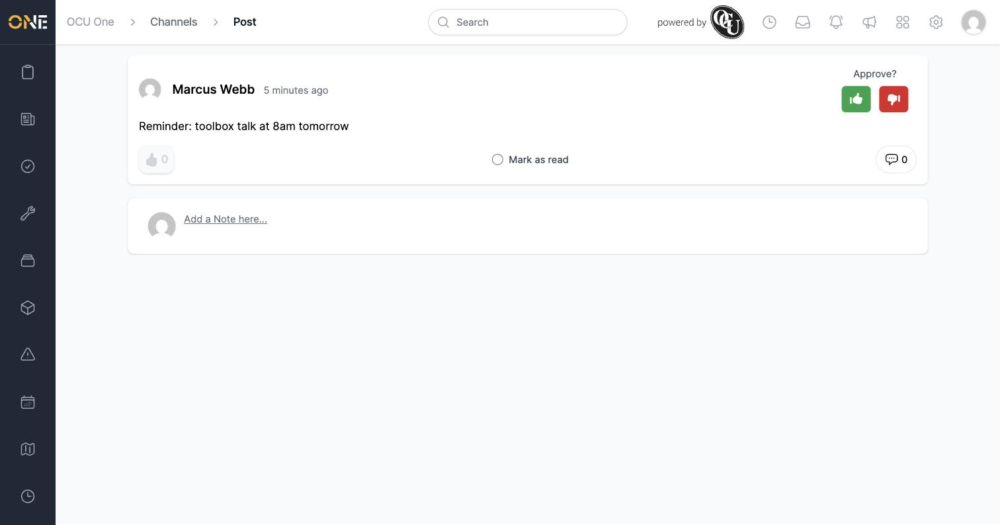
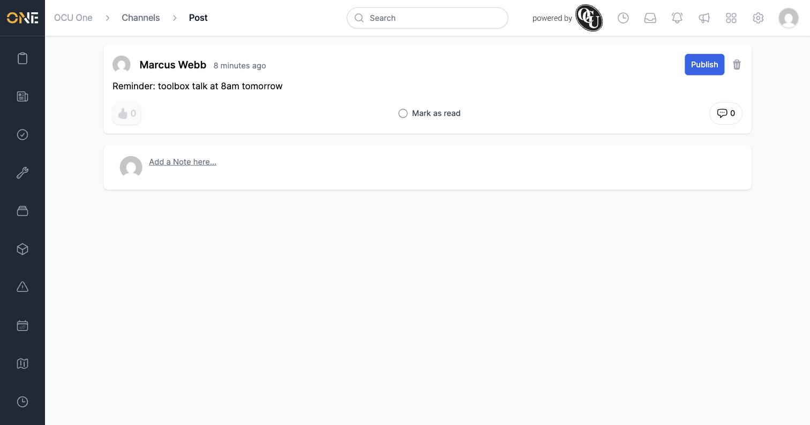
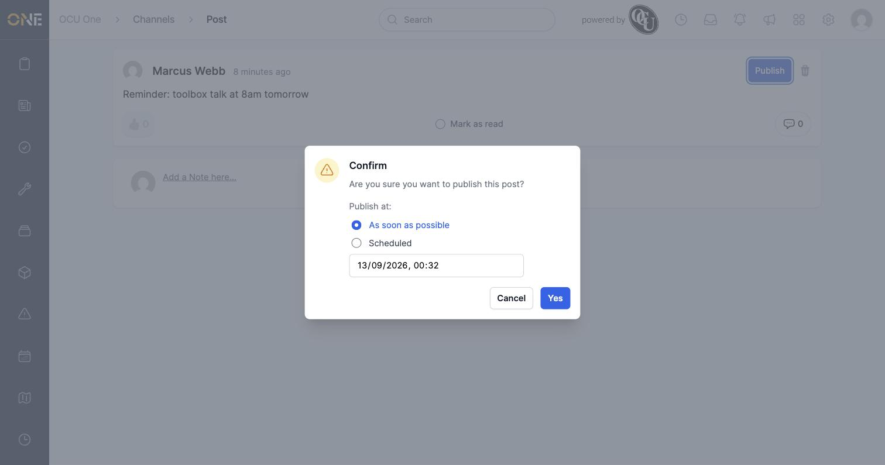
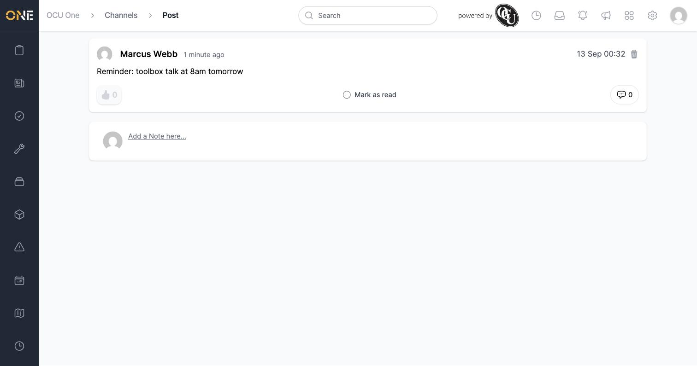

# Writing and publishing a quick post in a channel

A **post** is a short text update shared in a Hub channel — a quick announcement or reminder, without the formatting of a full article.

## Writing a post

Open the channel and use the post composer at the top of the feed.

1. Type your message in the box.
2. If people need to formally acknowledge reading it, tick **Must Read** — a **Read Until** date and time field appears, setting the deadline by which it should be read.

   

3. Click **Create Draft**. The post appears in the channel's feed with a **Draft** badge, visible only to people who can manage the channel.

   

## Moving it through review

Click the post to open its own page. From there:

1. Click **Submit For Review** and confirm. The post moves to **In review**, and the owner's own view now shows a **Move to Draft** option instead (an owner can withdraw their own post, but can't approve it).

   
   

2. Someone else with access to the channel sees an **Approve?** prompt with thumbs-up/thumbs-down buttons, plus a **Mark as read** option if the post needs acknowledging.

   

3. Approving moves it to **Ready to Publish**, showing a **Publish** button.

   

4. Click **Publish** and confirm — choose **As soon as possible** or **Scheduled** for a future date and time, just like publishing a Hub page.

   

Once published, the post shows its publish date instead of any workflow buttons.

## Things to know

- You can't approve or publish your own post — a different person with access to the channel needs to do that, same as with Hub pages.
- **Must Read** posts show up first in the channel feed for anyone who hasn't yet acknowledged them and whose deadline hasn't passed (see *Acknowledging a post or article*).
- Posts are plain text with basic formatting only — for anything needing a title, hero image, or richer layout, use an article instead (see *Writing and publishing a full article in a channel*).
