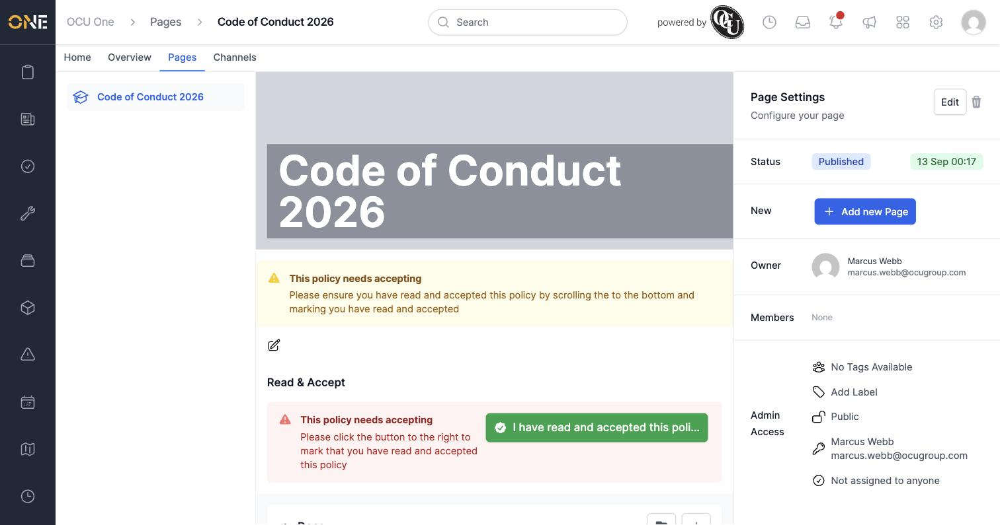
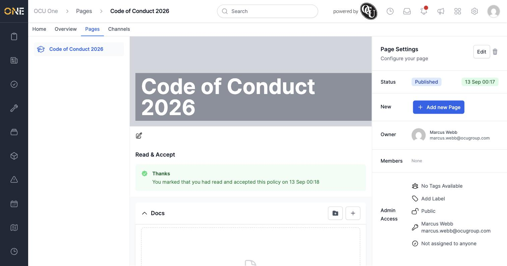

# Accepting a Hub page

Some pages — typically formal policies like a Code of Conduct — need everyone who reads them to explicitly confirm they've done so. This is turned on per-page via **Acceptance Type: Policy** and the **Allow users to mark they have read and accepted this page?** setting (see *Editing a Hub page's hero image, featured media, and settings*).

## Accepting a page

Open a page that requires acceptance. A yellow banner at the top reminds you to scroll down and confirm, and a **Read & Accept** section further down the page has the actual button.

Click **I have read and accepted this policy**. The section updates to confirm your acceptance, along with the date and time.

## Things to know

- Every user's acceptance is recorded individually — one person accepting a page doesn't accept it on anyone else's behalf.
- The reminder banner and the **Read & Accept** section only appear on pages where the owner has turned on the acceptance requirement — most pages don't need this at all.
- You need to be able to see the page in the first place to accept it — if it's private and hasn't been shared with you, ask the page's owner for access.
