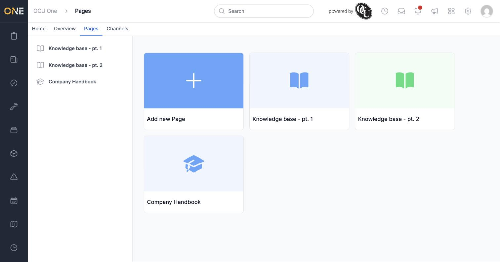
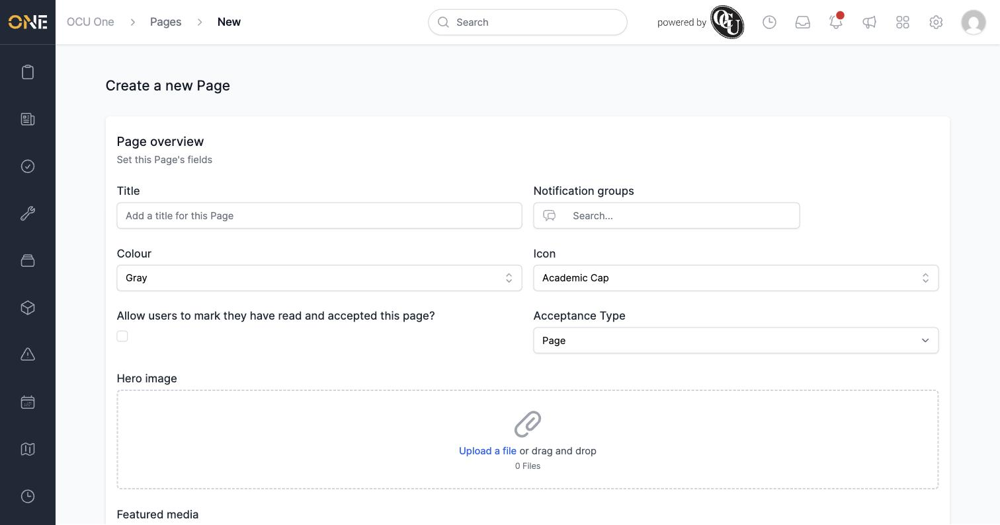
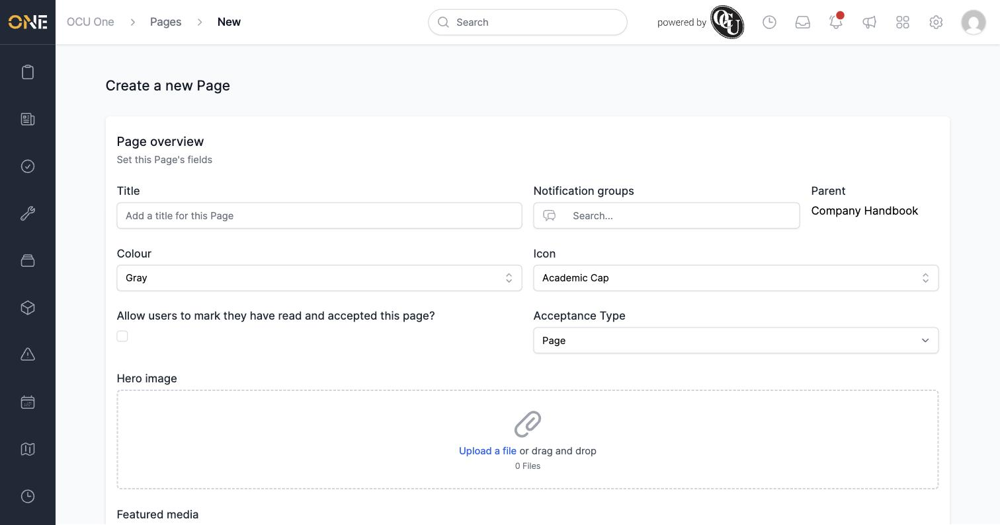
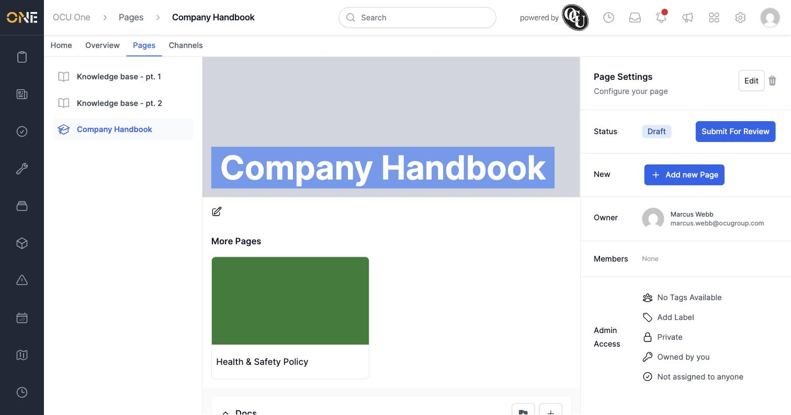

# Creating and organizing Hub pages (intranet CMS pages)

**Pages** are OCU One's built-in intranet — a place to publish reference material like handbooks, policies, and how-to guides so everyone in the company can find them in one place. Pages can be nested, so a top-level page can act as a folder for related pages underneath it.

## Browsing existing pages

Open **Pages** from the top navigation bar. Every page you have access to is shown as a tile, alongside an **Add new Page** tile for creating a new one.

## Creating a new page

1. Click **Add new Page**.
2. Fill in the page's fields:
   - **Title** — what the page will be called, e.g. **Company Handbook**.
   - **Notification groups** — who gets notified when this page changes.
   - **Colour** and **Icon** — used for the page's tile and banner.
   - **Allow users to mark they have read and accepted this page?** — turn this on if people need to formally acknowledge the page (see *Accepting a Hub page*).
   - **Acceptance Type** — **Page** for ordinary reference content, or **Policy** if it's a formal policy document that needs sign-off.
   - **Hero image** / **Featured media** — optional images shown on the page.

   

3. Click **Create Page**.

## Nesting a page under another one

To build out a structure — for example a "Company Handbook" page that contains several policy pages underneath it — open the parent page and click **Add new Page** in its **Page Settings** panel. The new page's form shows which page it will be nested under.

Once created, the child page appears as a tile under **More Pages** on the parent's own page, and the parent shows up in the left-hand pages tree with its child nested beneath it.

## Things to know

- Only top-level (root) pages show up on the main Pages index — a nested page is reached by opening its parent first, or via the pages tree in the sidebar.
- Creating and editing pages requires the Hubs permission **Manage Pages**, granted through your role's permission set (see *Creating permission sets*).
- A brand-new page starts in **Draft** status and is only visible to you until it's submitted for review and approved — see *Submitting, approving, rejecting, and publishing a Hub page*.
