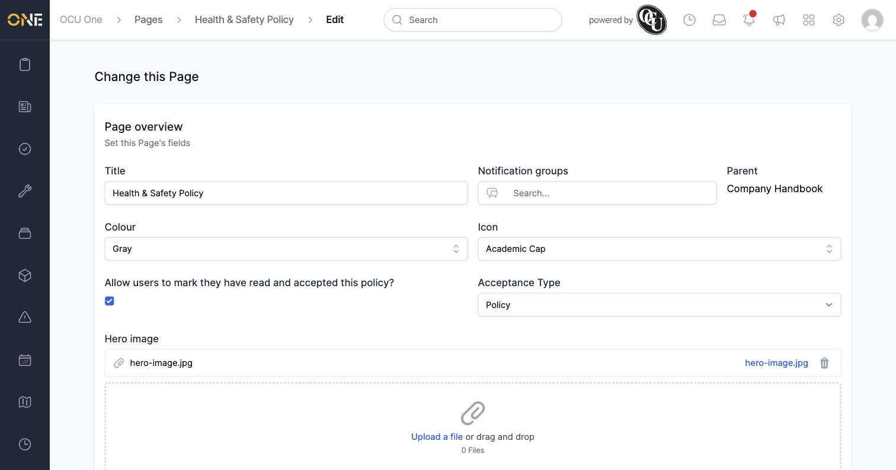
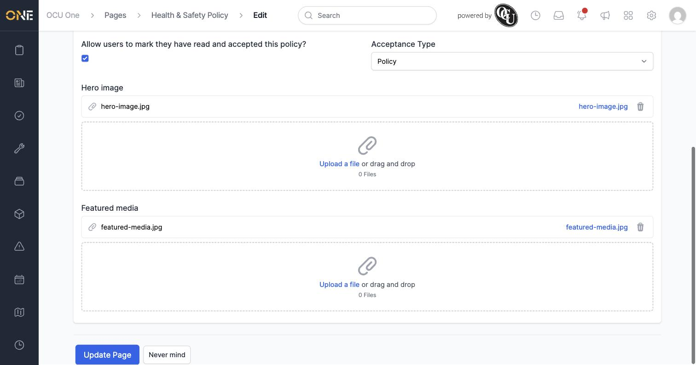
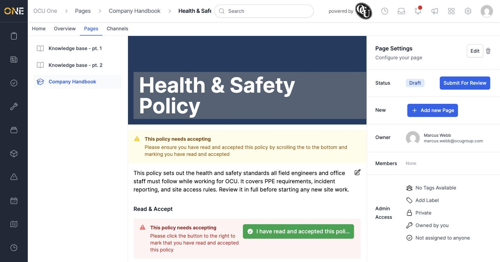

# Editing a Hub page's hero image, featured media, and settings

Once a page exists, you can go back and change any of its settings — its title, colour, notification groups, whether it needs formal acceptance, and the images shown on it.

## Opening the edit form

From the page, click the **Edit** button in the **Page Settings** panel (or use the pencil icon shown while viewing the page). This opens the same fields used when the page was first created.

## Changing acceptance settings

To require people to formally acknowledge a page — for example a policy document — turn on **Allow users to mark they have read and accepted this page?** and set **Acceptance Type** to **Policy**.

## Adding or removing a hero image and featured media

Scroll down to the **Hero image** and **Featured media** sections. Each has its own upload area — click **Upload a file** or drag a file in. Once a file is attached, it's listed with a trash icon next to it so you can remove it again.

Click **Update Page** to save your changes.

## What it looks like once saved

The hero image appears as a full-width banner behind the page title. If the page requires acceptance, a **"This policy needs accepting"** banner appears at the top, along with a **Read & Accept** section further down where the reader confirms they've read it (see *Accepting a Hub page*).

## Things to know

- **Hero image** and **Featured media** are separate uploads — the hero image is the banner behind the title; featured media is a supporting image shown elsewhere on the page.
- Removing a hero image or featured media takes effect as soon as you click **Update Page** — there's no separate confirmation step.
- Editing a page's settings requires the same **Manage Pages** permission as creating one.
