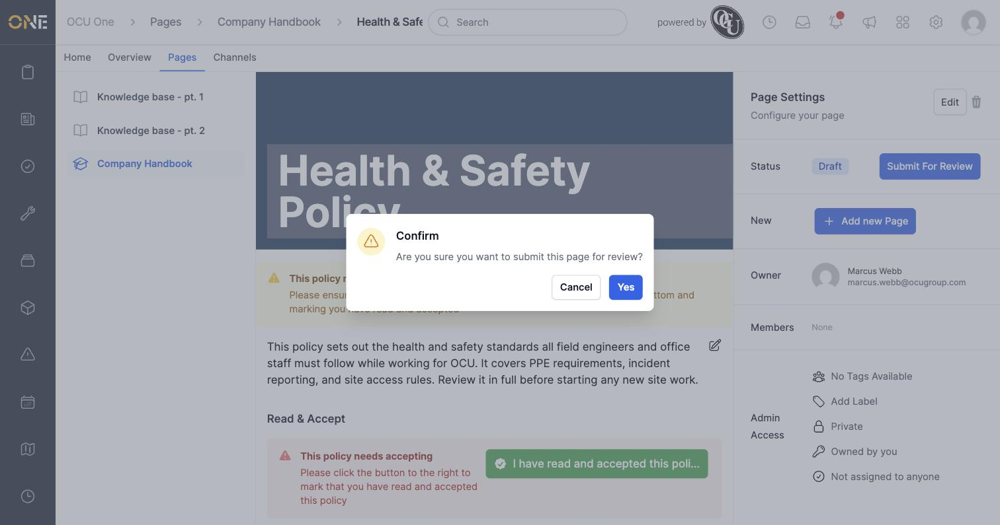
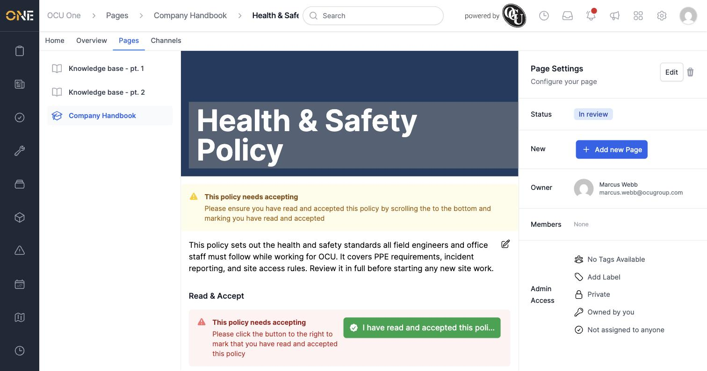
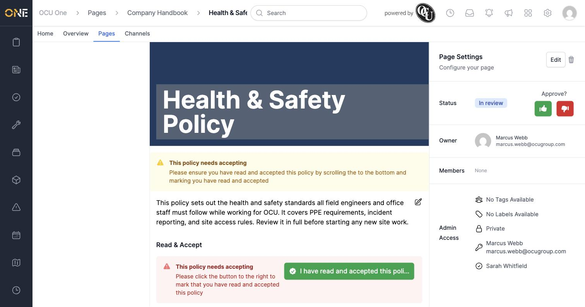
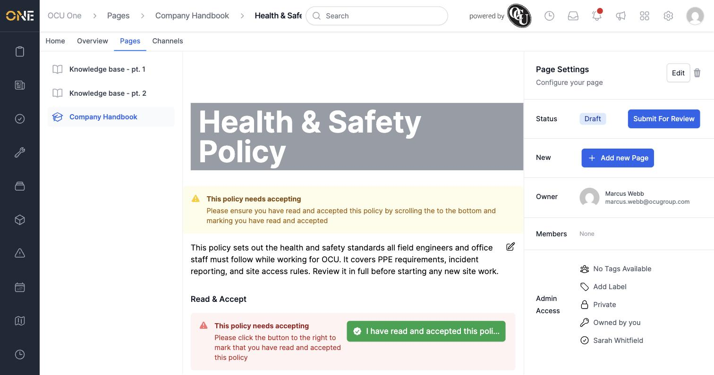
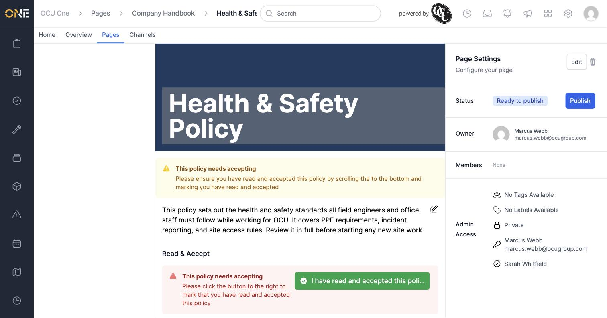
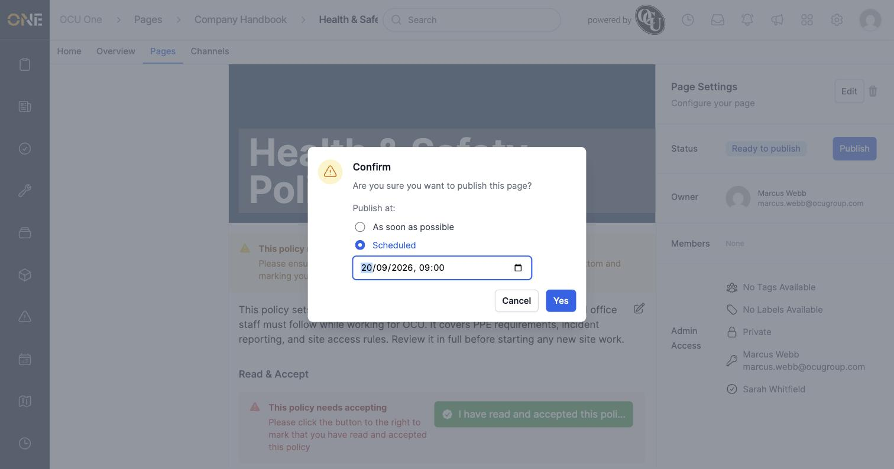
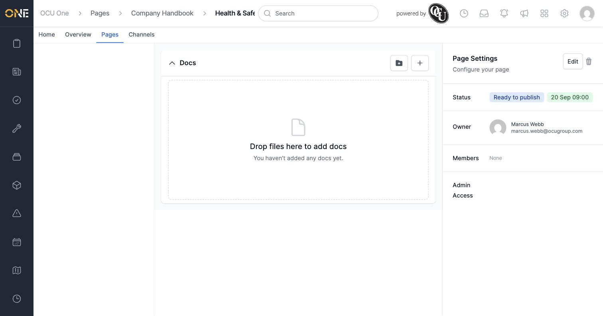

# Submitting, approving, rejecting, and publishing a Hub page

A page moves through a review process before it's visible to everyone: **Draft → In review → Ready to publish → Published**. Anyone can write and edit a draft, but it needs a second person to review it before it goes live.

## Submitting a page for review

From the page's **Page Settings** panel, click **Submit For Review** and confirm.

The page's status changes to **In review**.

## Reviewing a submitted page

A different person — someone with access to the page and permission to manage pages, who isn't the page's owner — sees an **Approve?** prompt next to the status, with a thumbs-up and thumbs-down button.

- **Thumbs down** sends the page back to **Draft** so the author can make changes and resubmit it.

  

- **Thumbs up** moves the page to **Ready to publish**.

  

## Publishing

Once a page is **Ready to publish**, click **Publish**. A confirm dialog lets you choose when it should go live:

- **As soon as possible** — publishes it right away.
- **Scheduled** — pick a future date and time; the page publishes itself automatically once that time arrives.

Once confirmed, the scheduled date and time is shown next to the status.

## Things to know

- A reviewer needs to actually be able to see the page first — a **Private** page is only visible to its owner until it's shared with specific people (or its visibility is widened), so add your reviewer under **Members** in Page Settings before asking them to approve it. See *Sharing or assigning a record to specific users*.
- You can't approve or reject your own page — the buttons only appear for someone else with access and the **Manage Pages** permission.
- Rejecting a page back to **Draft** removes it from view for anyone who only had access to it as a reviewer (not as an owner or a person it's explicitly shared with) — this is expected, since drafts are private to the owner unless shared.
- Once a scheduled page's publish time passes, it moves to **Published** automatically — there's no extra step to complete it.
