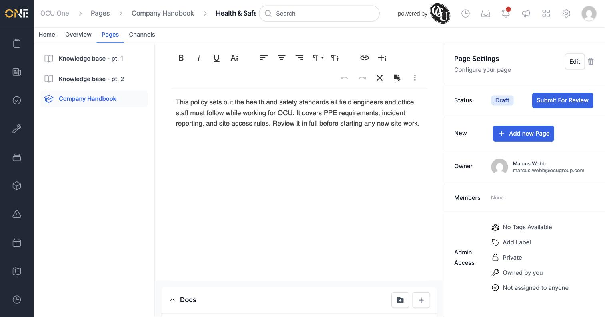

# Writing and updating a Hub page's body content inline

A page's main body text — the actual content people read — is written directly on the page itself, without needing to open a separate edit form.

## Editing the content

1. On the page, click the pencil icon shown above the body text (or, on a brand-new page, in the empty content area).
2. A rich text toolbar appears with formatting options — **Bold**, *Italic*, Underline, text alignment, paragraph style, inserting a link, and undo/redo.

   

3. Type or edit the text as needed.
4. In the toolbar's overflow menu (the **⋮** icon), click the save icon (shown as a document with a checkmark) to save your changes, or the **X** to cancel and discard them.

## What it looks like once saved

The content displays as plain formatted text on the page, with the pencil icon next to it so you can go back and edit it again at any time.

## Things to know

- There's no separate "edit page" screen for the body text — you write and save it directly on the page you're viewing.
- Editing content requires the same **Manage Pages** permission as any other change to a page.
- This is separate from a page's **Hero image** and **Featured media**, which are set from the page's **Edit** form (see *Editing a Hub page's hero image, featured media, and settings*).
