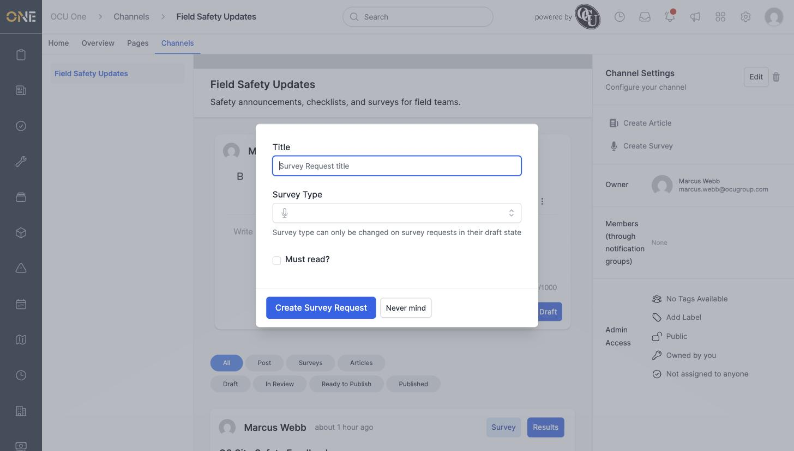
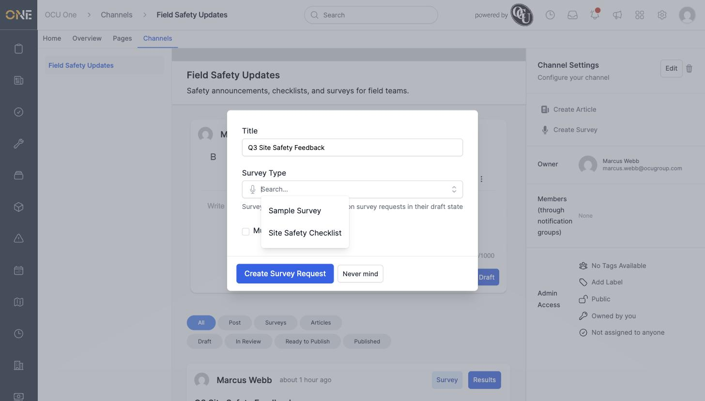
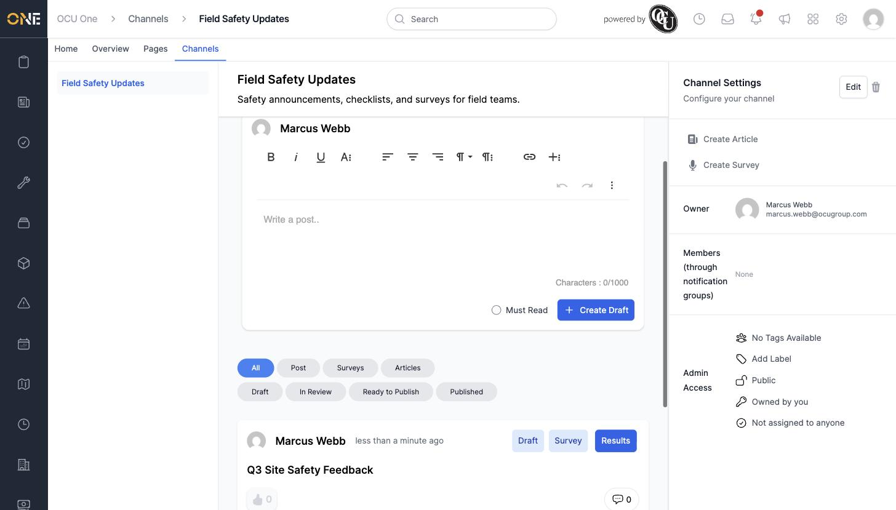

# Creating a survey (announcement) and setting up its questions

A **survey** is a set of questions you send out through a Hub channel and ask people to fill in — for example a site safety checklist or a feedback form. What questions it asks is decided by its **Survey Type**, which your organisation sets up in advance under **Settings > Hub > Survey Types** (see *Configuring Hub survey types*). Creating a survey itself just means picking a title and one of those existing survey types.

## Starting a new survey

1. Open the Hub channel you want to send the survey through, then click **Create Survey** in the right-hand panel.

   

2. Fill in:
   - **Title** — what people will see in the channel feed, e.g. **Q3 Site Safety Feedback**.
   - **Survey Type** — search and pick from the survey types already set up for your organisation. This is what actually decides the questions people will answer — you can't add or edit individual questions from here.
   - **Must read?** — tick this if people should be required to acknowledge the survey.

   

   

3. Click **Create Survey Request**. It appears straight away in the channel feed as a card with a **Draft** badge — only you (and other admins) can see it at this point.

   

## Things to know

- Once a survey request leaves the draft state, its survey type can no longer be changed — the field on the form becomes read-only, showing the type name instead of the picker.
- The actual questions come entirely from the survey type's attached field set — pick the survey type that already asks what you need, or ask an admin to build a new one first (see *Configuring Hub survey types* and *Building a field set with field groups and field types*).
- Creating a survey request doesn't send anything yet. It stays in **Draft** until it's submitted for review, approved, and published — see *Submitting, approving, and publishing a survey request*.
