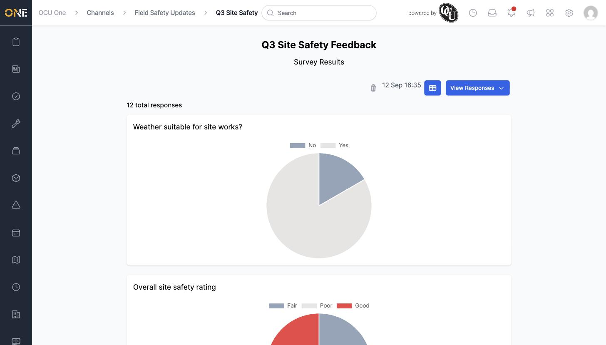
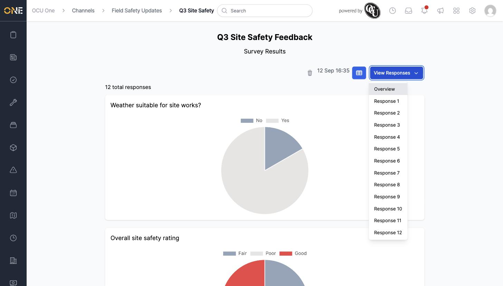
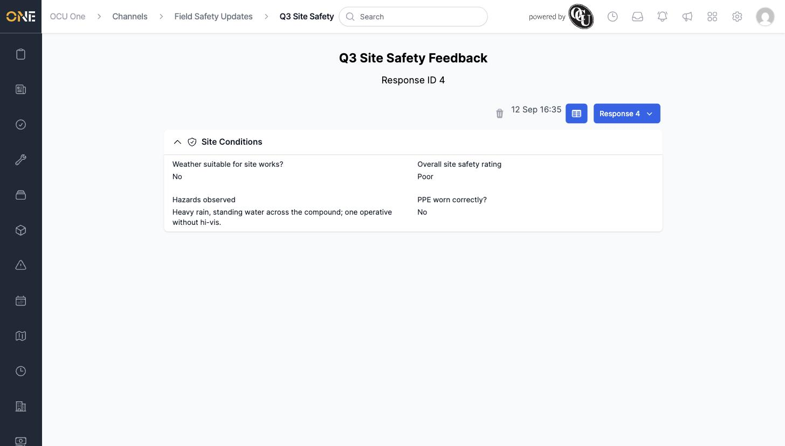

# Viewing survey results and individual responses

Anyone who can manage a Hub channel can open a survey's **Results** page to see how people have answered so far — both an aggregated overview and, in principle, each person's individual response.

## The results overview

Click **Results** on a survey's card in the channel feed to open its Survey Results page. It shows the total number of responses so far, and a chart for every question — a pie chart for Yes/No and multiple-choice questions, breaking down how many people picked each answer.

Scrolling down shows a chart like this for every question on the survey.

## Drilling into one respondent

The **View Responses** dropdown at the top of the page lists every individual response by number ("Response 1", "Response 2", and so on), intended to let you open one specific person's answers.

Clicking any of these numbered responses currently does not open that response — it navigates to an unrelated page that fails to load with a server error, so this is not usable as a way to browse individual answers today. The screen it's meant to show, once reached, displays that person's answer to every question, grouped by section — for example:

## Things to know

- The response count and charts on the overview always reflect everyone who has completed the survey so far, updating as more people respond.
- Charts only render for questions with a fixed set of answers (dropdowns); a free-text question like "Hazards observed" doesn't get its own chart on the overview — its answers are only visible per-respondent.
