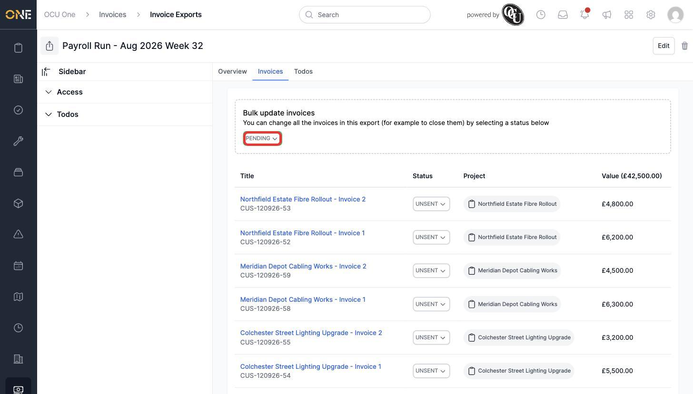
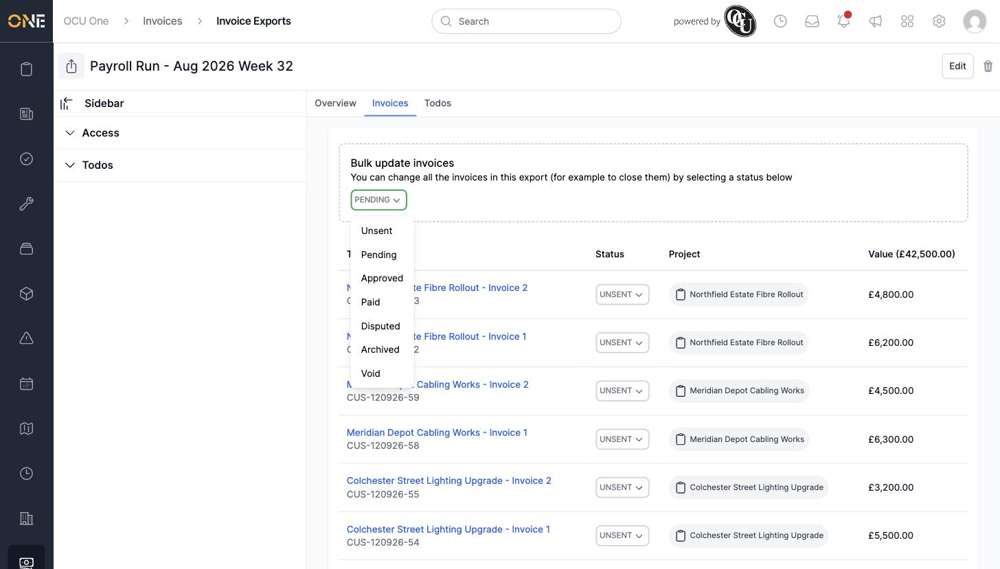
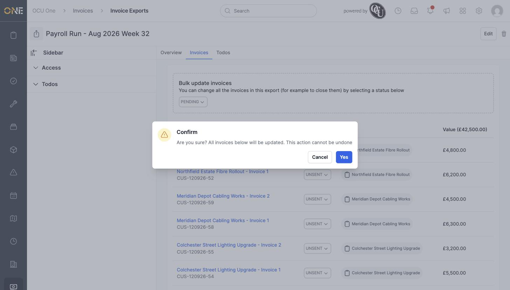
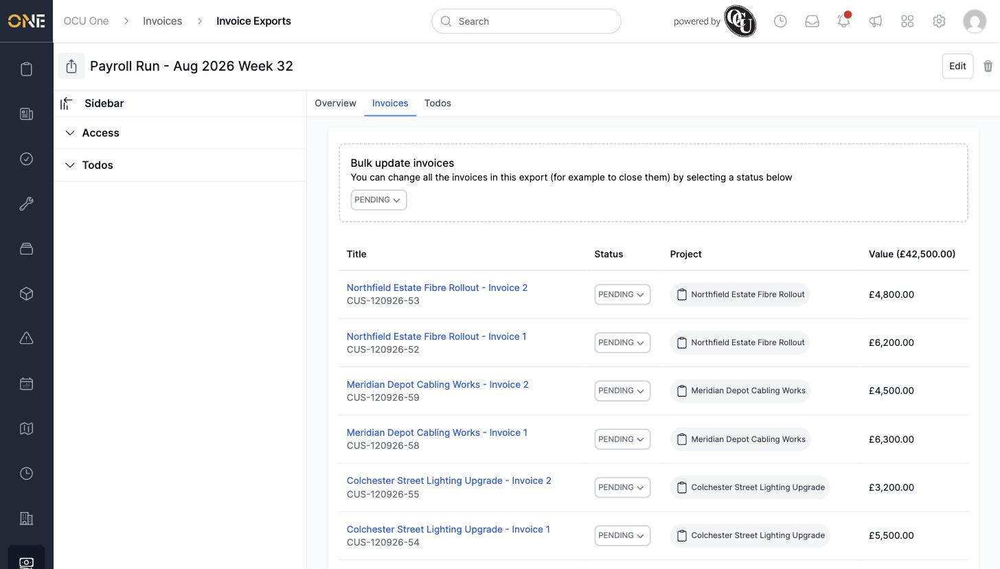

# Bulk-updating invoice statuses within an export

Instead of changing each invoice's status one at a time, you can update every invoice in an Invoice Export in a single action from the **Invoices** tab.

## Using the Bulk update invoices box

1. Open the Invoice Export and go to its **Invoices** tab. Near the top is a **Bulk update invoices** box: "You can change all the invoices in this export (for example to close them) by selecting a status below."

   

2. Click the status dropdown to see the available statuses: **Unsent, Pending, Approved, Paid, Disputed, Archived, Void**.

   

3. Choosing a status shows a confirmation: "Are you sure? All invoices below will be updated. This action cannot be undone."

   

4. Clicking **Yes** updates every invoice in the export to the chosen status. The **Status** column for each invoice in the list reflects the change.

   

## Things to know

- This action cannot be undone from the confirmation dialog — double check the status you've chosen before clicking **Yes**.
- The bulk update applies to every invoice currently in the export, not a selected subset.
