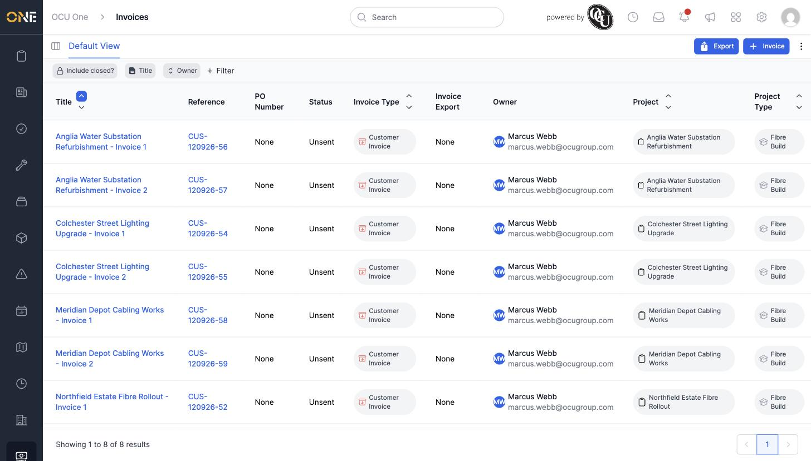
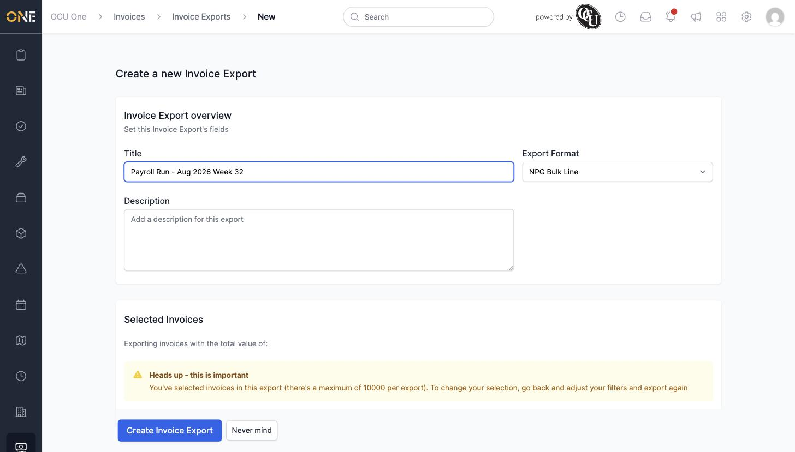
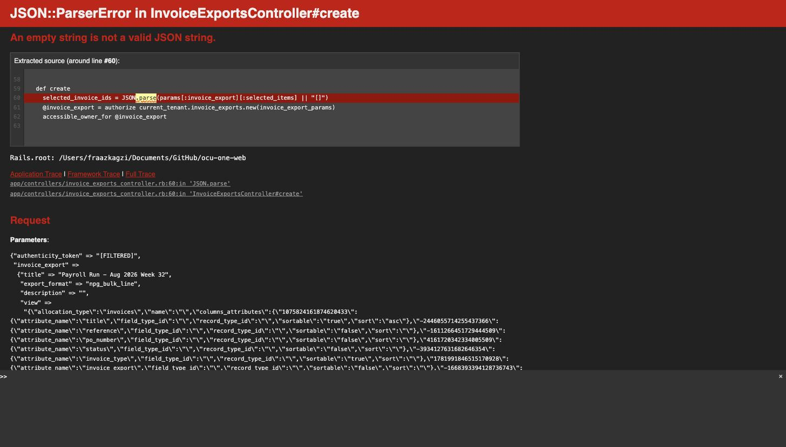

# Creating a batch invoice export

An Invoice Export bundles up a batch of invoices — for example, everything ready to send to a payroll or finance system in one go. This screen is reached from the **Invoices** list.

## Starting an export

1. On the **Invoices** list, filter the list down to the invoices you want to export if needed.
2. Click **Export** in the toolbar.

   

3. On the "Create a new Invoice Export" page, fill in a **Title** and choose an **Export Format** (**NPG Bulk Line** or **NPG Batch PDF**).

4. The "Selected Invoices" section shows no count, no total value, and no list of invoices underneath it.

   

5. Clicking **Create Invoice Export** leads to a server error page rather than creating the export.

   
