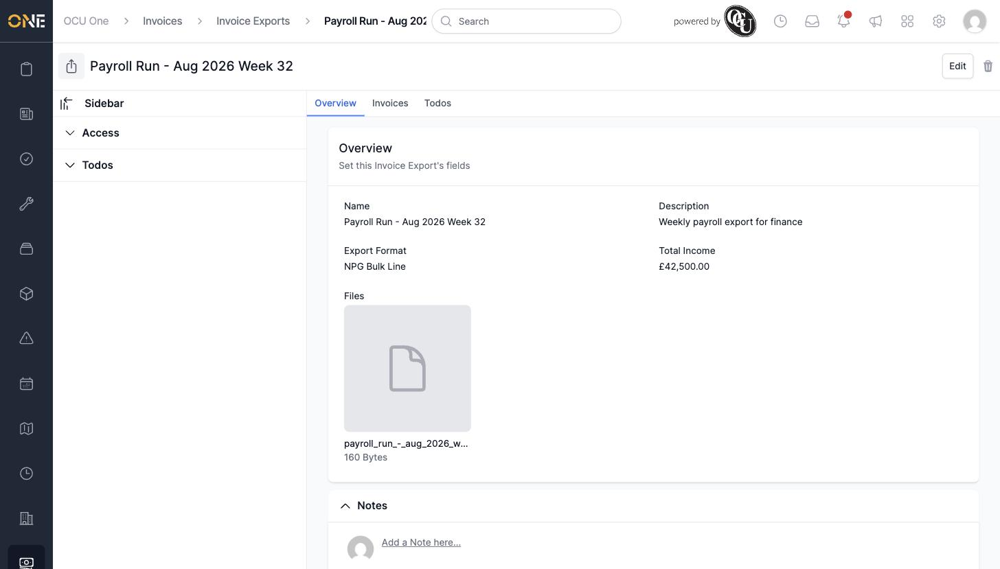
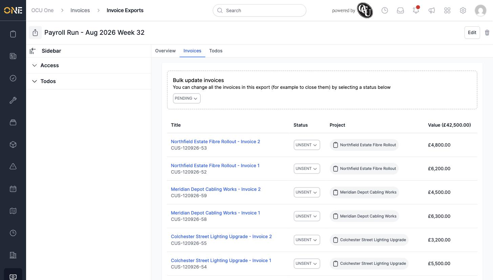
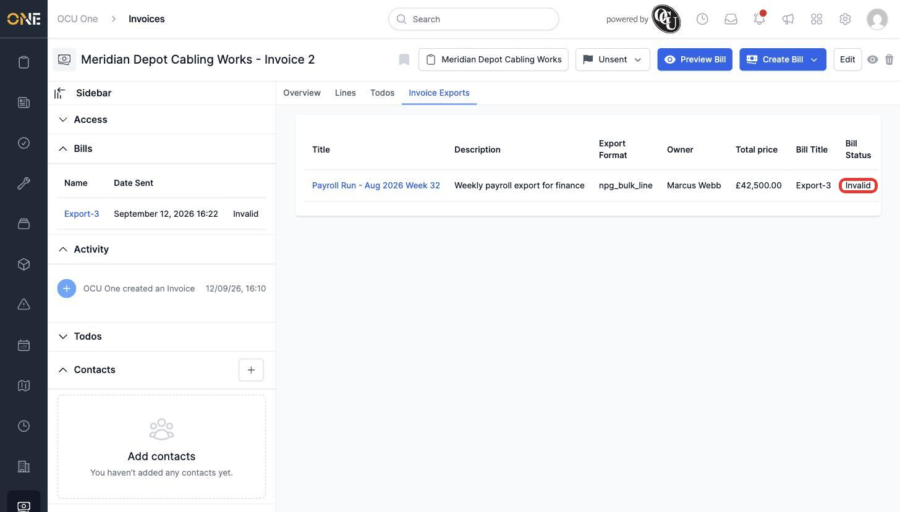

# Viewing and managing an invoice export

Once an Invoice Export exists, its own page lets you check its details, review every invoice included in it, and see whether each invoice's export file is valid.

## Overview tab

Opening an Invoice Export shows its **Overview** tab first: the **Name**, **Description**, **Export Format**, **Total Income**, and the generated export **Files**.

The sidebar alongside it has **Access** and **Todos** sections that can be expanded.

## Invoices tab

The **Invoices** tab lists every invoice in the export, each with its own **Status**, **Project**, and **Value**, plus the export's combined total shown in the column header.

## Checking a bill's status

Each invoice in an export gets its own **bill** — the actual generated export line for that invoice — and a bill can be **Valid** or **Invalid**. To check on one, open the invoice itself (from the Invoices tab) and look at its **Bills** panel in the sidebar, or its **Invoice Exports** tab.

## Things to know

- An **Invalid** bill means that particular invoice's export line didn't generate a usable file — the rest of the export can still be valid even if one bill isn't.
- The export's **Total Income** always reflects every invoice attached to it, regardless of any individual bill's status.
