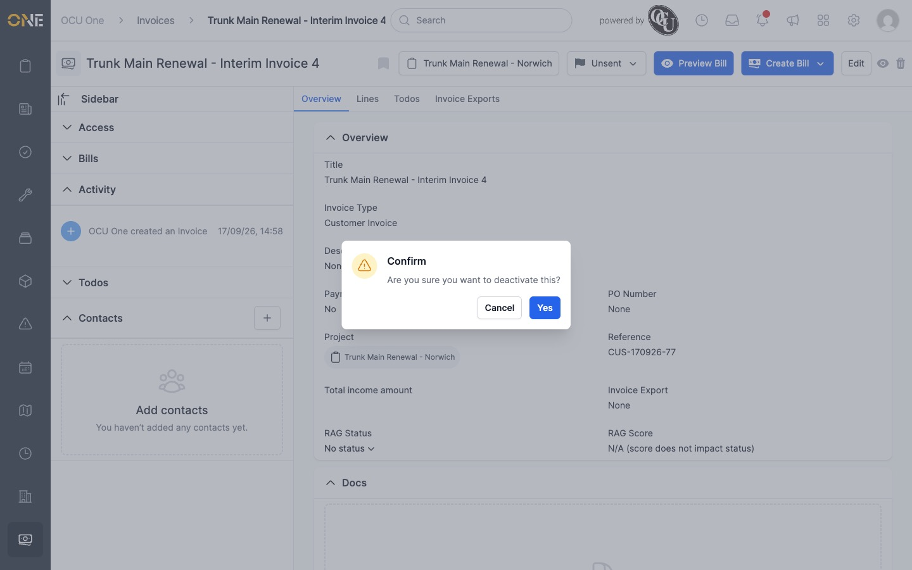
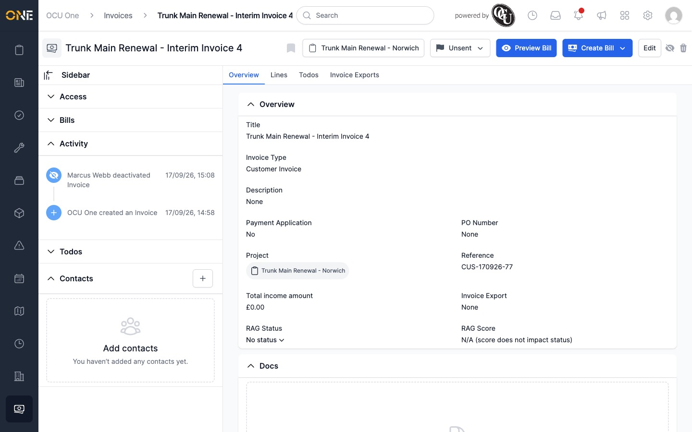
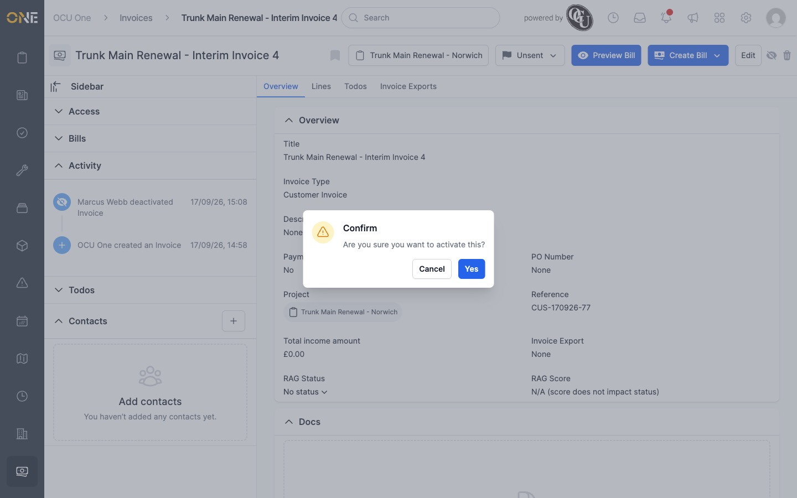

# Activating or deactivating an invoice

This is only available while an invoice is still **Unsent**.

1. Open the invoice's Overview page.
2. Click the eye icon next to Edit, near the top right.

   

3. Confirm the action when asked.

   

Once deactivated, the eye icon shows with a line through it.

Click the same icon again and confirm to reactivate — it returns to a plain
eye icon.

