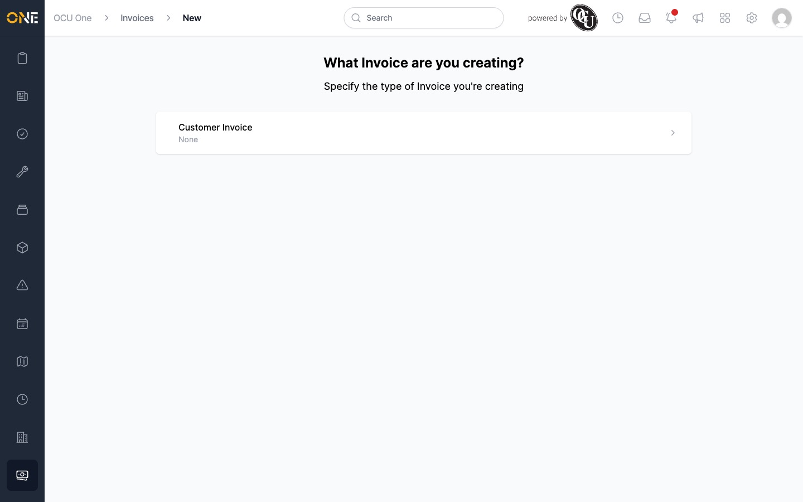
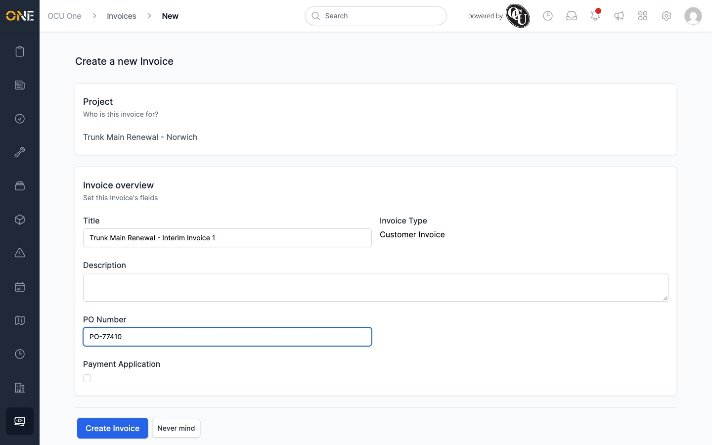
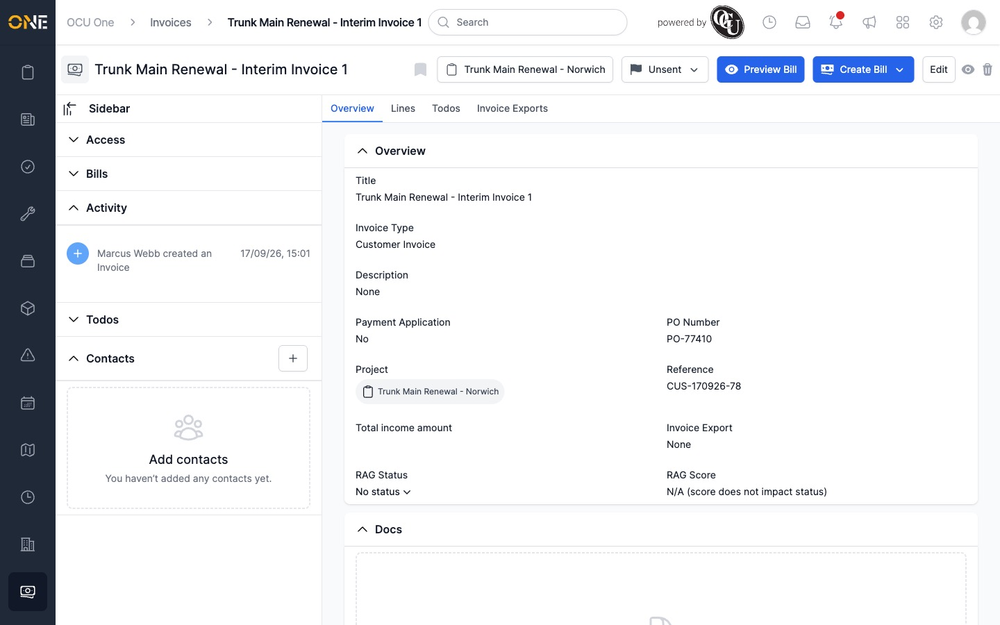

# Creating a new invoice

Invoices are created against a project, so the way most people start one is from
that project's **Invoices** tab.

## Starting a new invoice

1. Open the project you want to invoice, and go to its **Invoices** tab.
2. Click **+ Invoice**.
3. You'll be asked what kind of invoice you're creating. In this tenant there's
   currently only one type to choose from, **Customer Invoice**.

   

4. Fill in the invoice's details:
   - **Title** — a name for the invoice, shown everywhere it's listed.
   - **Description** — optional extra detail.
   - **PO Number** — the client's purchase order reference, if they've given you
     one.
   - **Payment Application** — a checkbox for invoices that are a payment
     application rather than a standard invoice.

   The **Invoice Type** and the **Project** it belongs to are shown for
   reference and can't be changed here.

   

5. Click **Create Invoice**.

## What happens next

The invoice is created in the **Unsent** status and you're taken to its
Overview page, where you can add lines, set a PO number or RAG thresholds,
create and send a bill, or change its status. See the other Invoicing guides
for each of those.

