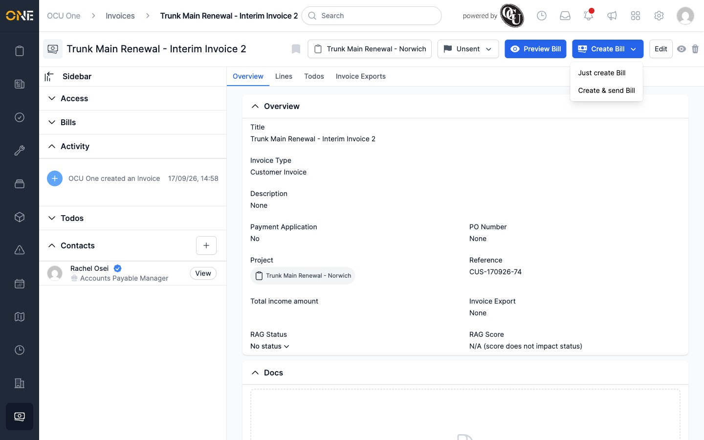
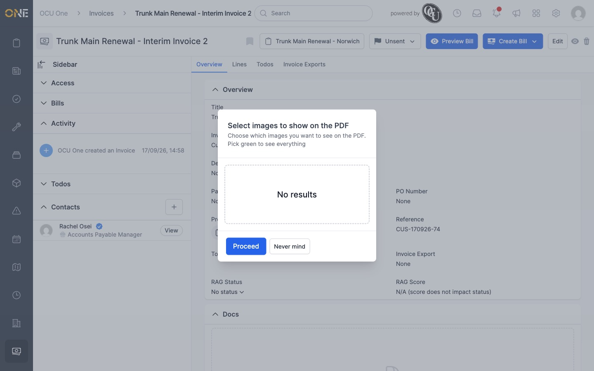
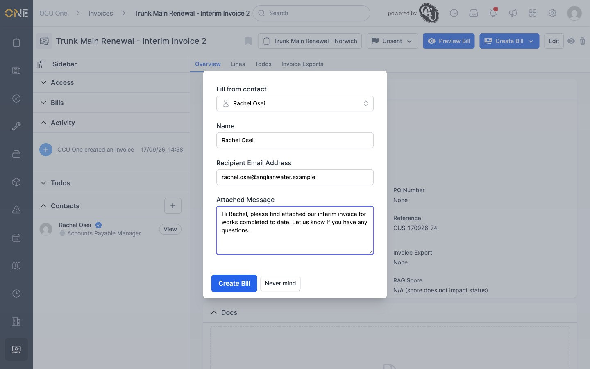
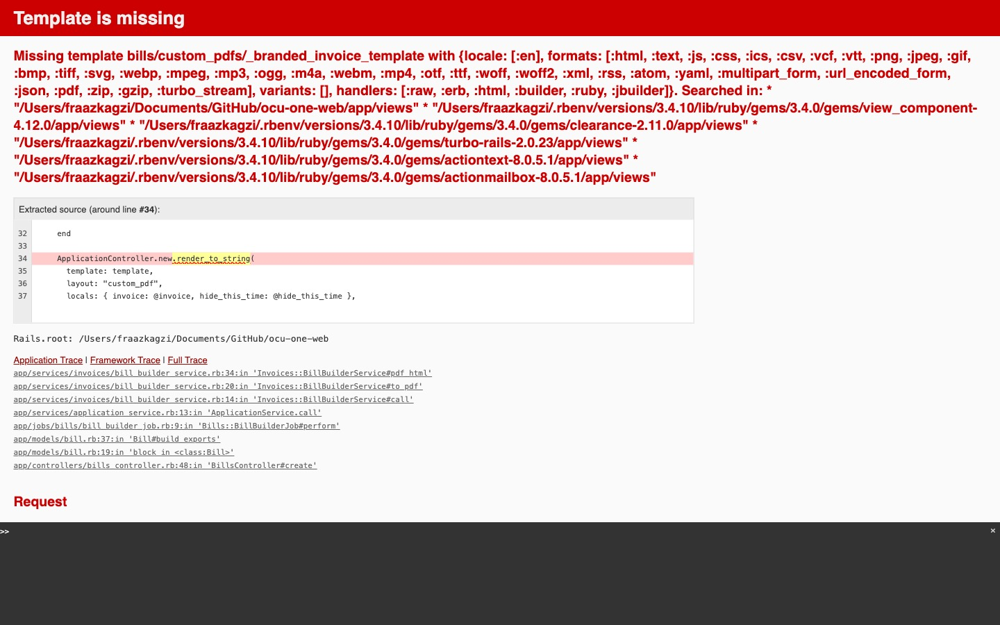
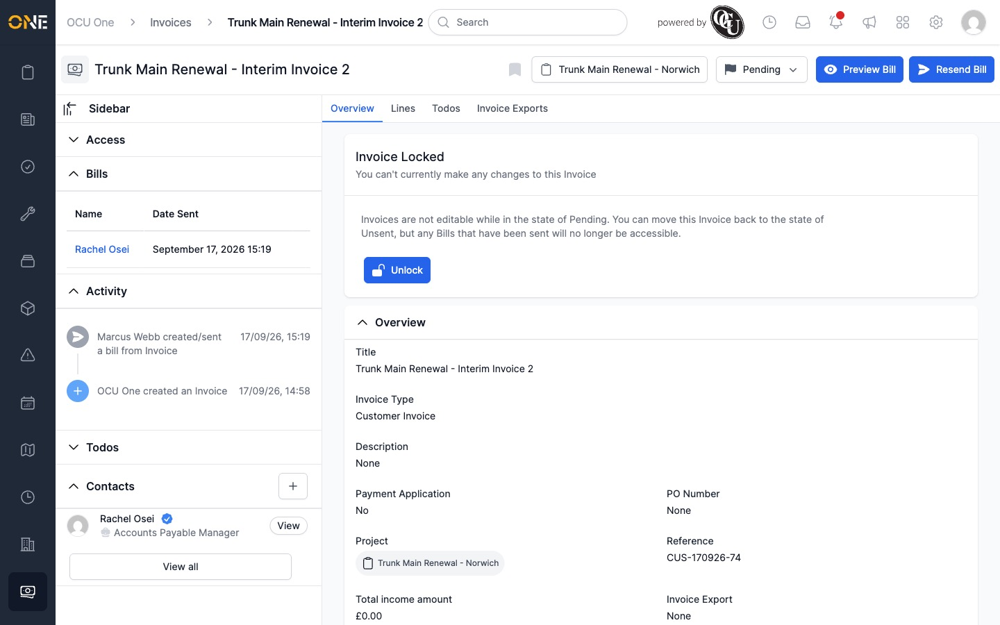

# Creating and sending an invoice bill (PDF) to a client

A **bill** is the PDF version of an invoice that gets sent to your client.

## Adding a contact to send it to

Before sending a bill, add the person you're sending it to as a contact on
the invoice: open the **Contacts** section on the invoice's Overview page and
click **+**, then fill in their name, position, and email, ticking **Primary**
so they're the default recipient.

## Creating or sending a bill

1. Open the invoice's Overview page (the invoice must still be **Unsent**).
2. Click the **Create Bill** button's dropdown arrow and choose:
   - **Just create Bill** — creates the bill without emailing it.
   - **Create & send Bill** — creates the bill and emails it to the recipient.

   

3. On the "Select images to show on the PDF" screen, choose which images to
   include (or none) and click **Proceed**.

   

4. Fill in the bill:
   - **Fill from contact** — pick a contact already added to the invoice to
     auto-fill their name and email.
   - **Name** and **Recipient Email Address**.
   - **Attached Message** — an optional note included with the email.

   

5. Click **Create Bill**.

## What happens next

Attempting to finish creating a bill this way currently crashes with a
"Template is missing" error — the invoice type this tenant uses is
configured to use a custom PDF template that doesn't exist in the app.

Despite the crash, the bill record itself is still created: it appears in
the invoice's **Bills** list with the recipient's name and the date sent, and
the invoice's activity feed logs it as sent. No PDF file is actually attached
to it, and no email is actually delivered.

