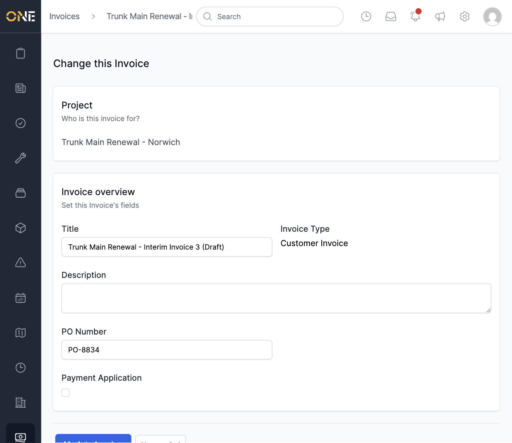
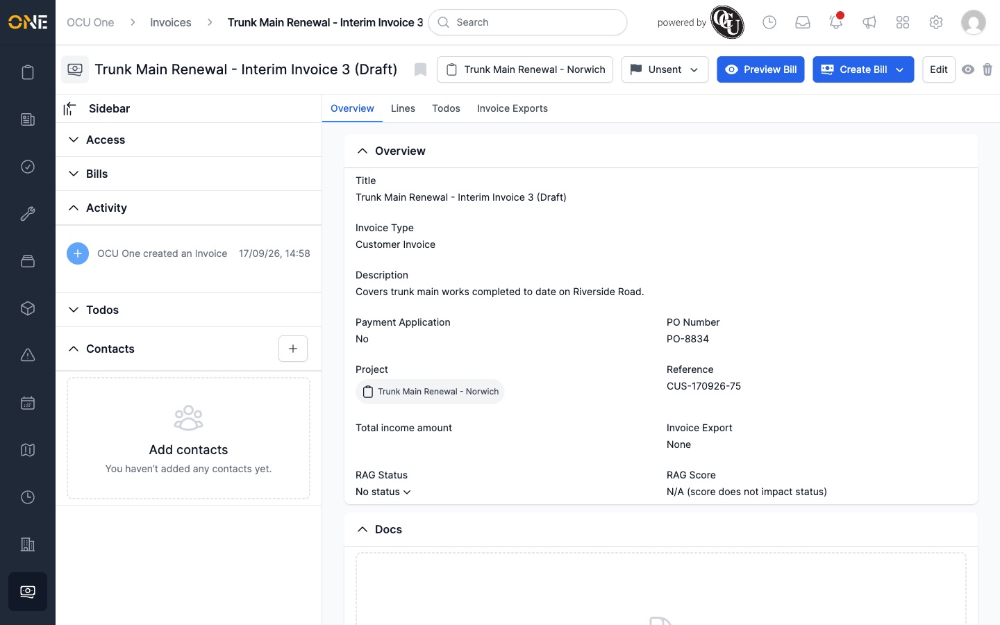
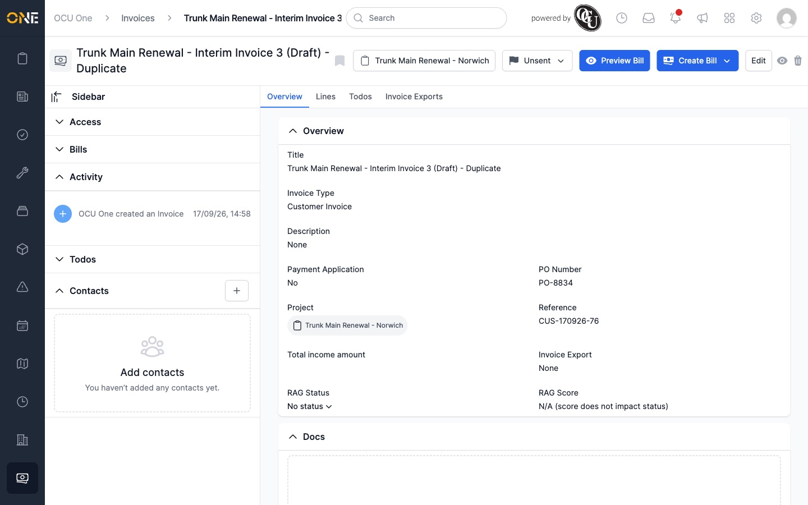
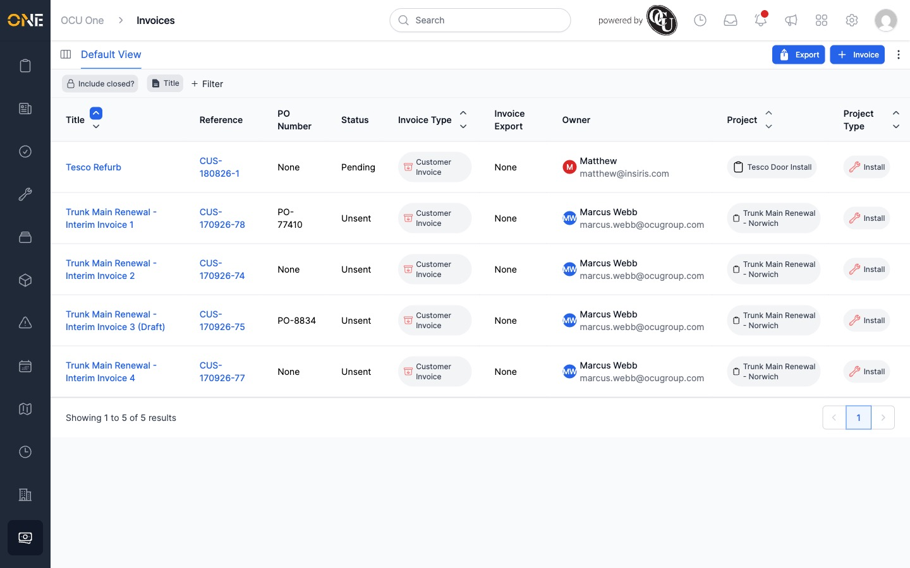

# Editing or deleting an invoice

Editing and deleting are only available while an invoice is still **Unsent**
— once it's been sent on, its Edit and Delete controls disappear.

## Editing an invoice

1. Open the invoice's Overview page and click **Edit**.
2. Change any of **Title**, **Description**, or **PO Number**. The invoice
   type and project can't be changed here.

   

3. Click **Update Invoice**.

## Deleting an invoice

Each Unsent invoice's Overview page has a bin icon next to Edit — click it to
delete the invoice. You'll be asked to confirm ("Are you sure you want to
delete this?") before it's removed.

Once confirmed, the invoice is gone from the Invoices list.

