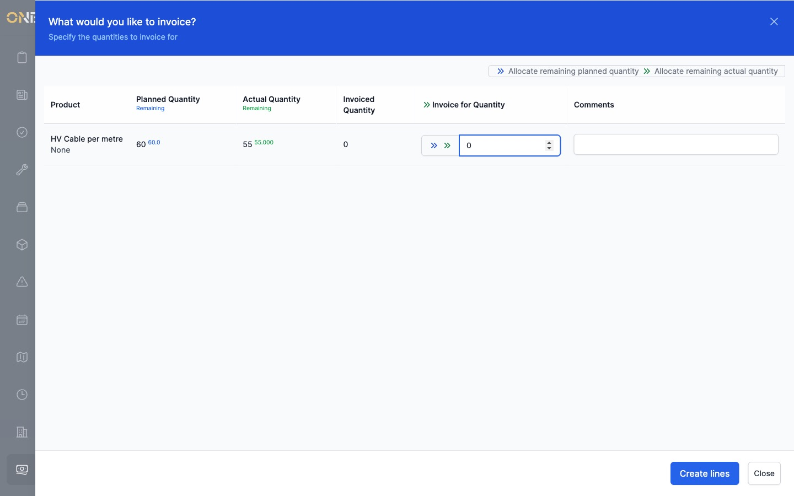
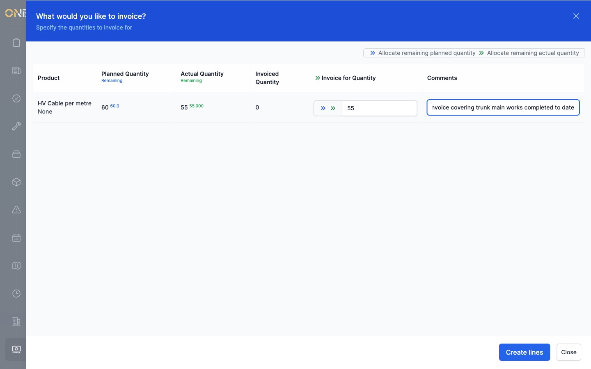
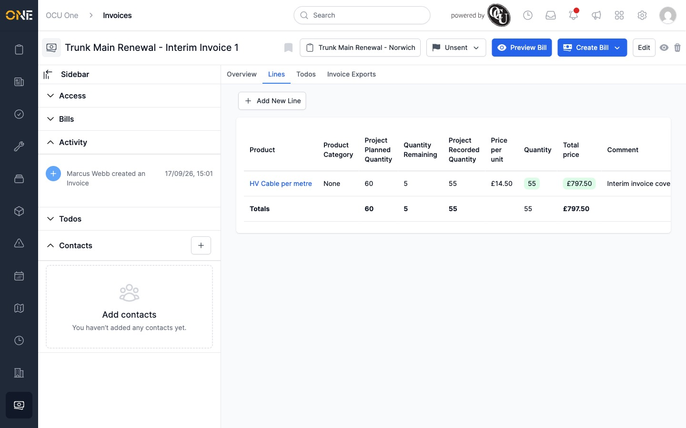
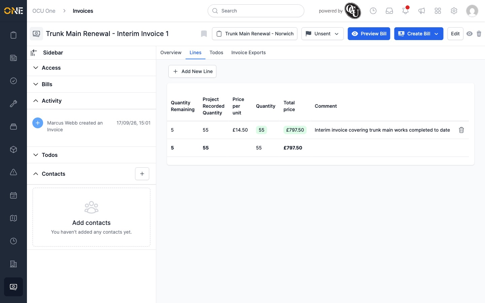

# Managing invoice lines

An invoice's **Lines** tab is where you pull in the actual work that's been
recorded against the project and turn it into billable lines.

## Adding lines

1. Open the invoice and go to its **Lines** tab.
2. Click **+ Add New Line**.
3. A list of the project's recorded product usage appears, showing for each
   product its **Planned Quantity** and **Actual Quantity** (each with how
   much is still **Remaining**), and how much has already been **Invoiced**.

   

4. For each product you want to bill, either:
   - Type a quantity directly into **Invoice for Quantity**, or
   - Use the **»** shortcut next to that row to fill in the full **remaining
     planned** quantity, or the **»»** shortcut to fill in the full
     **remaining actual (recorded)** quantity.
   - Add an optional **Comment**, which will show against the line.
5. Click **Create lines**.

   

The line now appears in the invoice's Lines table, with its planned and
recorded quantities and how much of each is remaining.

## Removing a line

Each line in the table has a delete (bin) icon at the end of its row — click
it to remove that line from the invoice.

