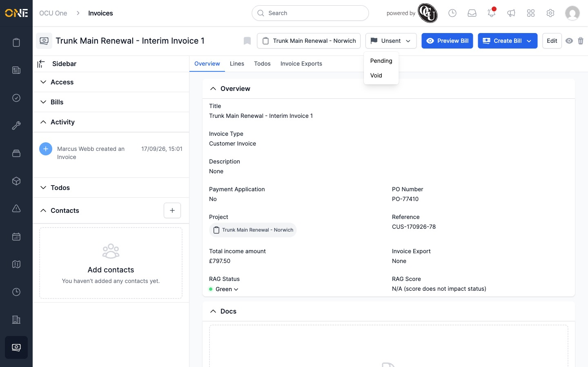
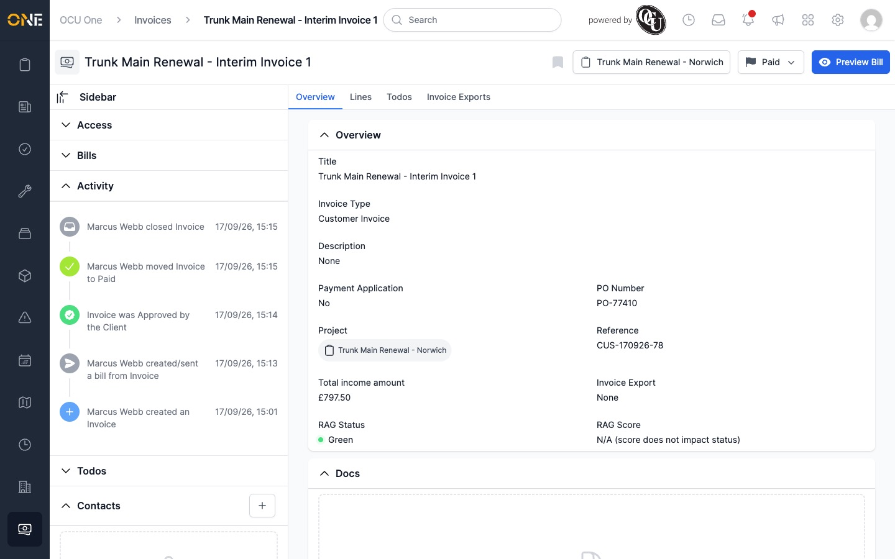
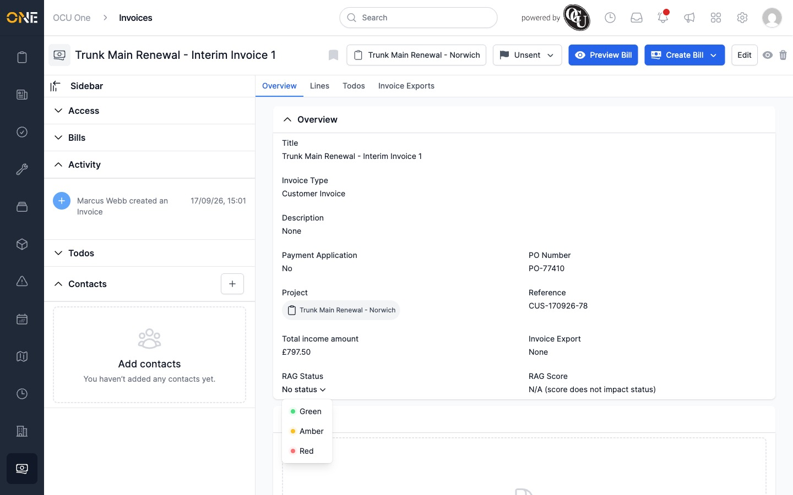
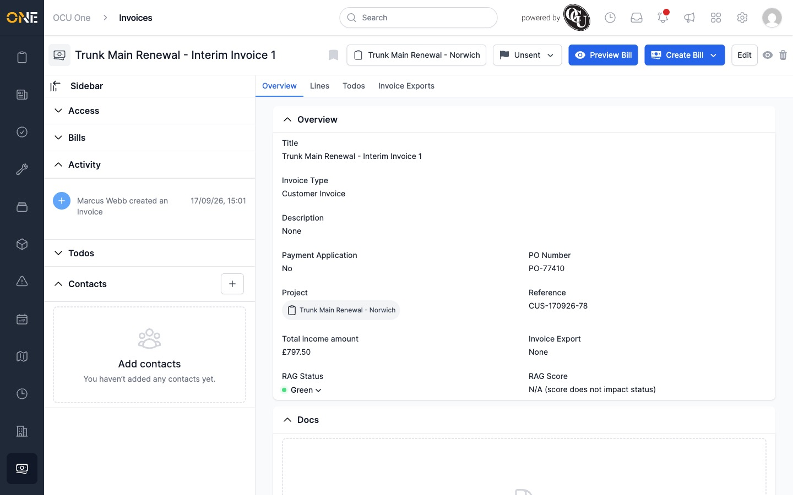

# Updating invoice status and RAG rating

## Changing an invoice's status

An invoice's status is shown as a dropdown button near the top of its
Overview page. Click it to see the statuses you can move to next — only
valid next steps are offered, not every possible status.

A new invoice starts as **Unsent**. From there you can move it to:

- **Pending** — the invoice has been sent and is now locked: you can no
  longer edit its details, lines, or activate/deactivate it, and a banner
  explains this ("Invoice Locked... Invoices are not editable while in the
  state of Pending"). An **Unlock** button lets you move it back to Unsent if
  you need to make a change — but any bills already sent won't be accessible
  afterwards.
- **Void** — cancels the invoice.

Once **Pending**, it can move on to:

- **Approved** — recorded as approved by the client.
- **Disputed** — recorded as disputed by the client.
- **Void**
- back to **Unsent** (via Unlock)

Once **Approved**, it can move to **Paid** or **Void**. Moving an invoice to
**Paid** also closes it — its activity feed shows the full history of every
change.

## Setting a RAG rating

If the invoice's type has RAG tracking turned on, a **RAG Status** field
appears on the Overview page, next to a **RAG Score**. Click the RAG Status
value to choose **Green**, **Amber**, or **Red**.

RAG can only be changed while the invoice is still **Unsent** — once it
moves to Pending or beyond, the RAG Status is fixed.
