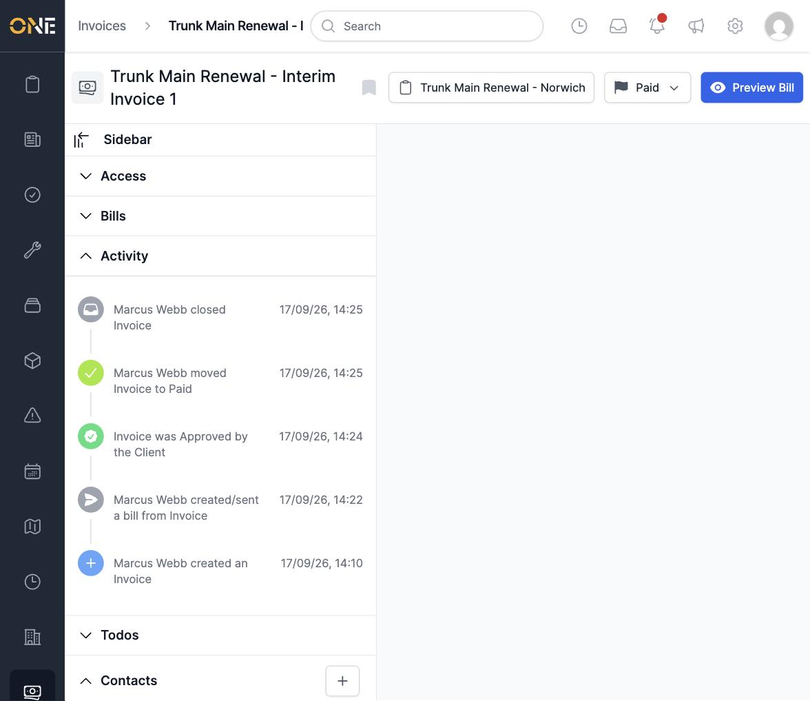
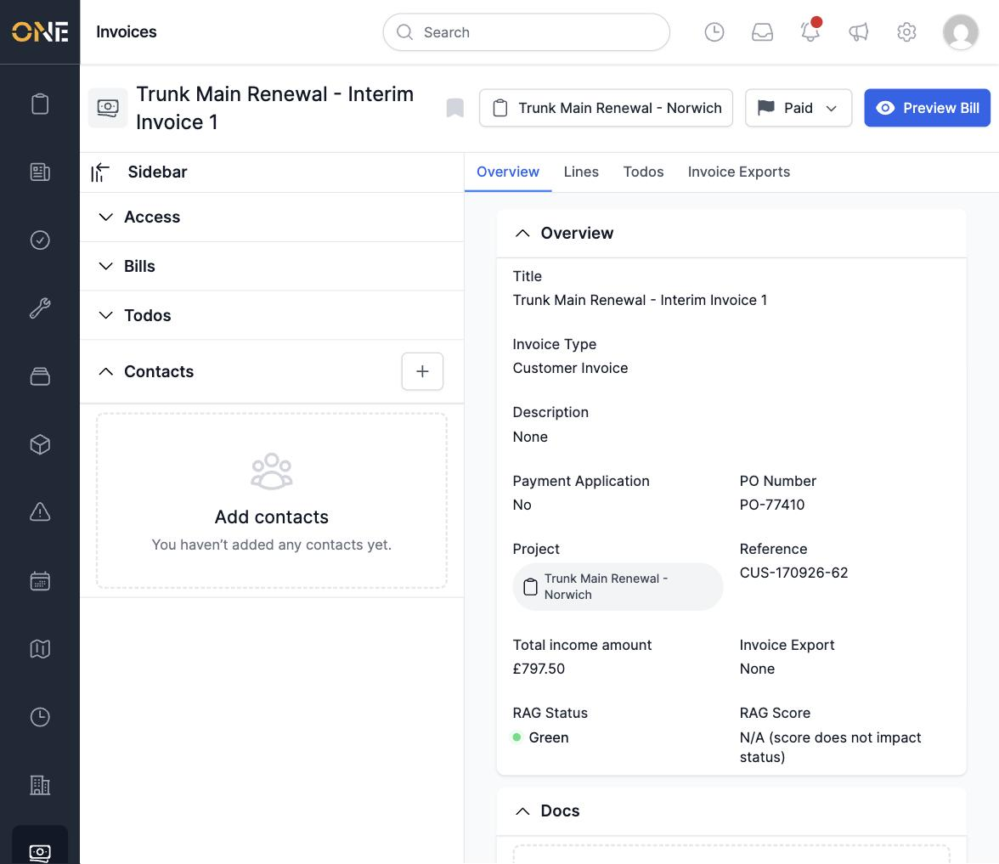

# Viewing an invoice overview

Open any invoice to land on its Overview page, which is split into a header
and four tabs: **Overview**, **Lines**, **Todos**, and **Invoice Exports**.

The header shows the invoice's title, the project it belongs to, its status,
and quick actions such as **Preview Bill**.

The Overview tab lists the invoice's key details:

- **Title**, **Description**, **Invoice Type**, and **PO Number**
- **Payment Application** — whether this invoice is a payment application
- **Project** it belongs to, and its **Reference**
- **Total income amount** — the value of everything on its Lines tab
- **Invoice Export** — which export it's part of, if any
- **RAG Status** and **RAG Score**, if the invoice type has RAG tracking on

Below the main fields, a **Docs** section lets you attach supporting
documents, and a sidebar on the left shows the invoice's **Access**
(visibility/ownership), any **Bills** sent, its full **Activity** history,
**Todos**, and **Contacts**.
