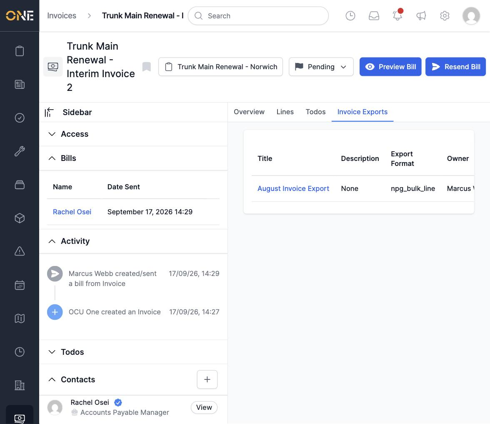
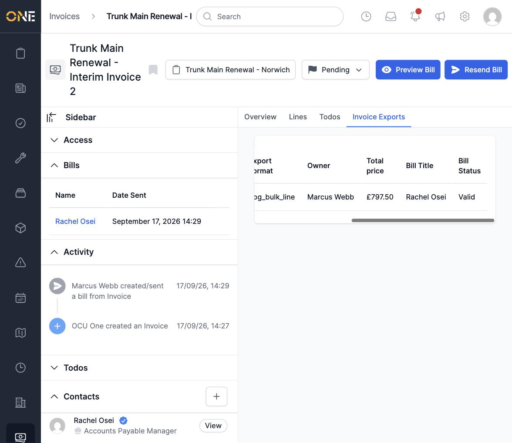

# Viewing an invoice's export history

An invoice's **Invoice Exports** tab lists every export that a bill of this
invoice has been included in.

For each export it shows the export's **Title**, **Description**, **Export
Format**, **Owner**, **Total price**, along with the specific **Bill Title**
(the bill recipient's name) and that bill's **Bill Status** (e.g. Valid).

Click an export's title to open that export and see everything else included
in it.
