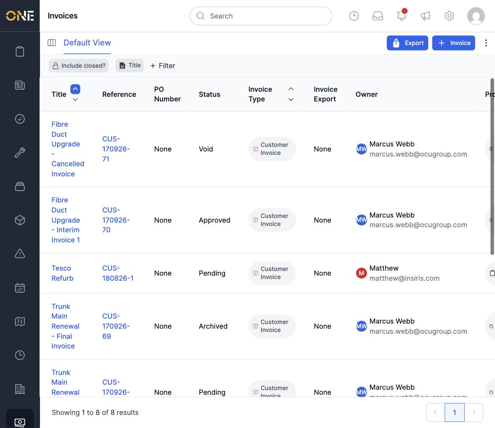
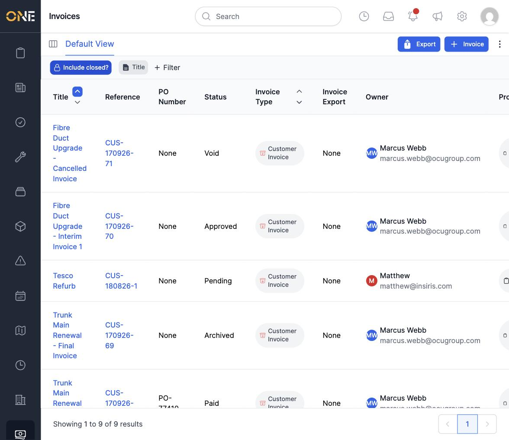
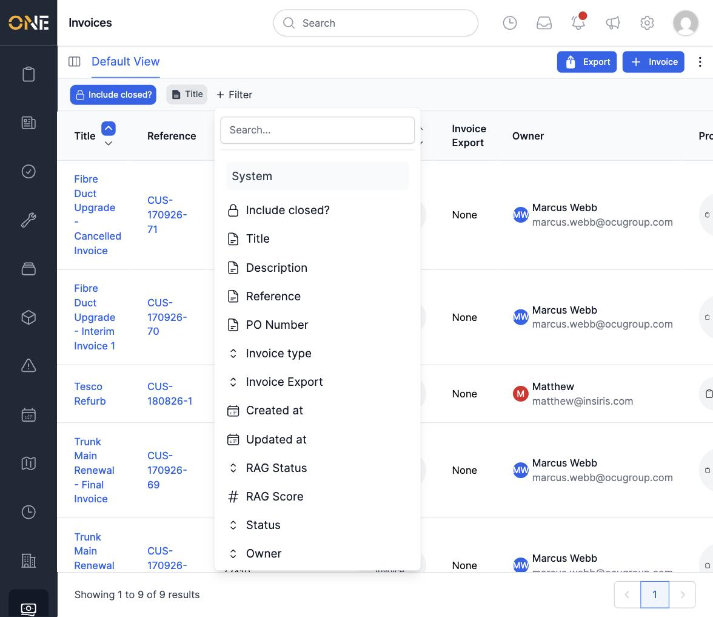
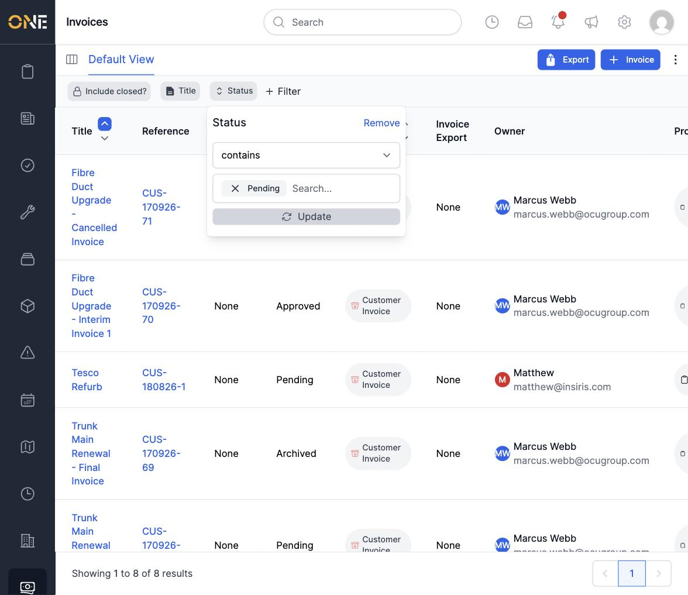
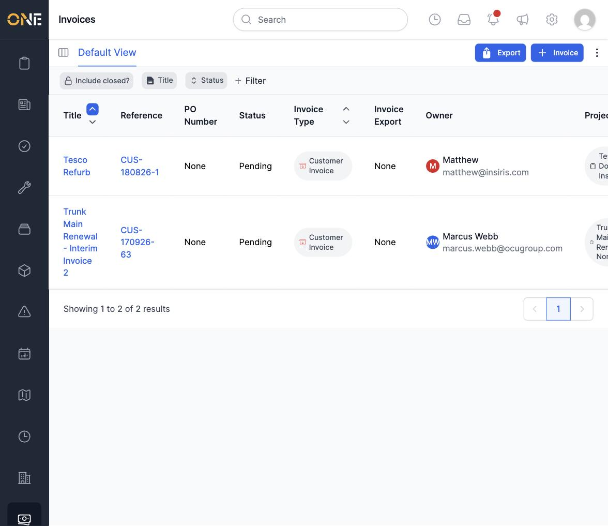
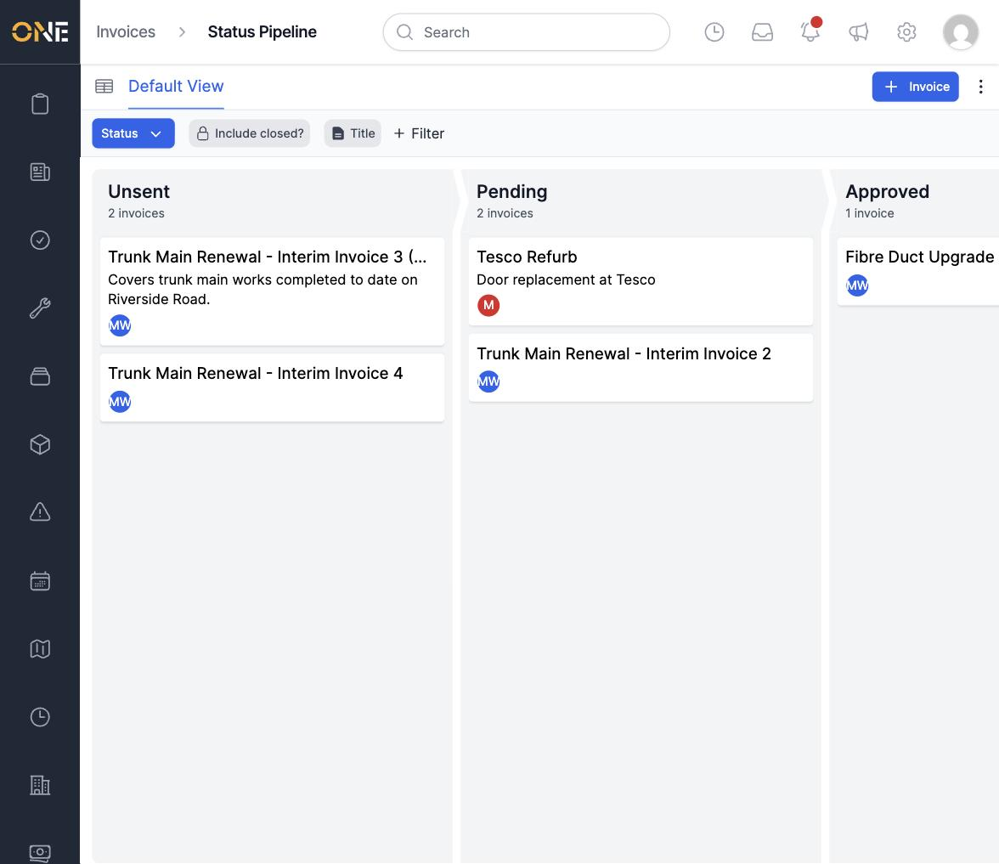

# Viewing and filtering the invoices list and pipeline

## The invoices list

The Invoices list shows every invoice with its Title, Reference, PO Number,
Status, Invoice Type, Invoice Export, Owner, and Project.

By default, closed invoices (**Paid** and **Archived**) are hidden. Toggle
**Include closed?** to show them too.

### Filtering

Click **+ Filter** to add a filter on any field — Title, Description,
Reference, PO Number, Invoice Type, RAG Status, RAG Score, Status, Owner, and
more.

Adding a **Status** filter lets you pick from the real statuses (Unsent,
Pending, Approved, Paid, Disputed, Archived, Void) — type to search, pick a
value, then click **Update**.

## The status pipeline (board view)

Switch to the pipeline view to see invoices grouped into columns by status,
each showing how many invoices it holds.

