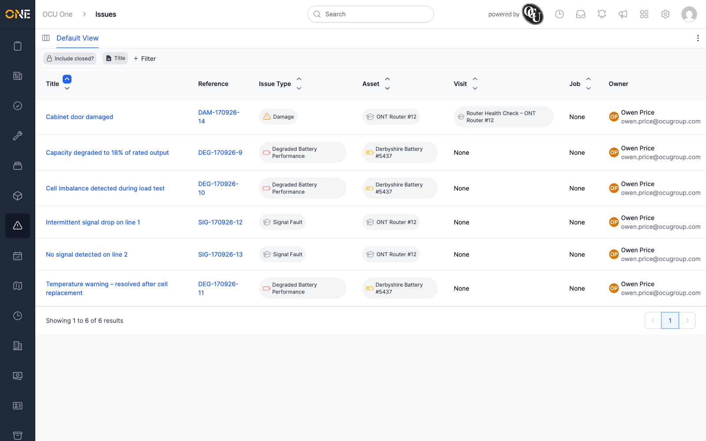
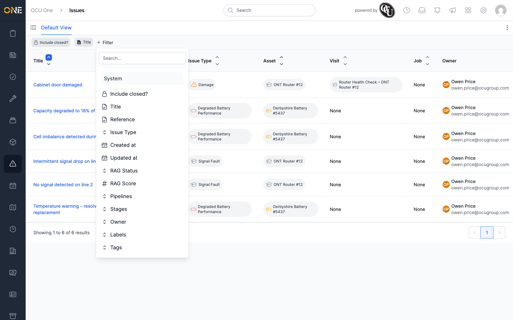
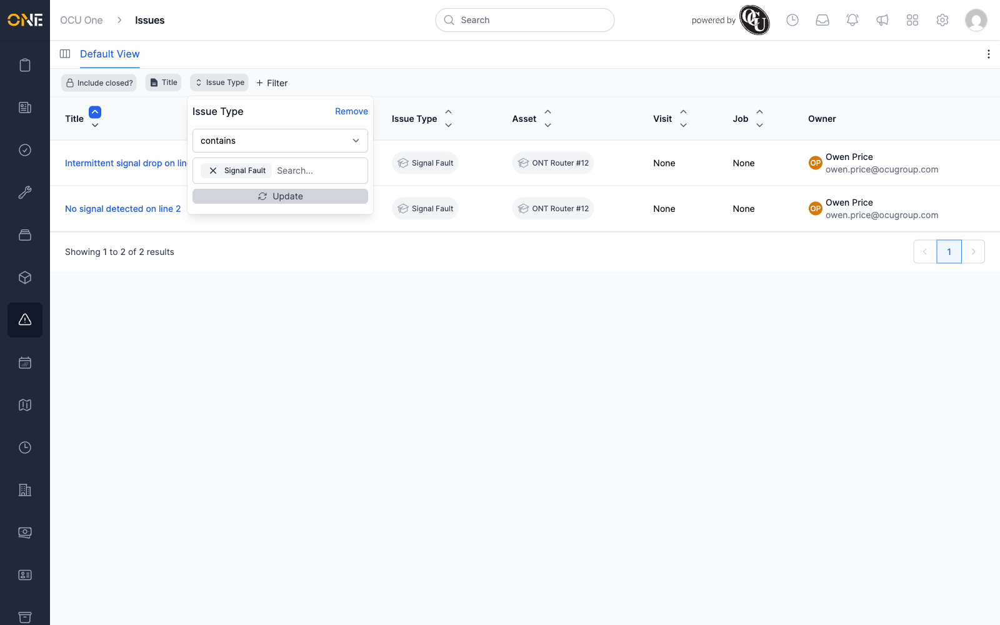

# Browsing issues

The **Issues** list shows every issue raised against an asset or a visit —
a damaged cabinet, a battery losing capacity, a signal fault — in one
place, regardless of which asset or visit it came from.

## The Issues list

Each row shows the issue's **Title**, **Reference**, **Issue Type**,
**Asset**, **Visit**, **Job**, and **Owner**.

Click any column header's arrows to sort by that column. Click a title to
open the issue itself (see
[Viewing an issue's overview page](Viewing%20an%20issue's%20overview%20page.md)).

## Filtering the list

Click **+ Filter** to see everything you can filter by — Title, Reference,
Issue Type, Created/Updated dates, RAG Status, RAG Score, Pipelines,
Stages, Owner, Labels, and Tags.

Pick a field — Issue Type, for example — type or select a value, and click
**Update** to apply it. The list narrows immediately and the filter stays
visible as a chip you can adjust or remove.

To drop a filter, open it again and click **Remove**.

## Include closed

By default the list hides issues sitting in a **closed** pipeline stage
(see
[Resolving an issue (moving through pipeline stages)](Resolving%20an%20issue%20%28moving%20through%20pipeline%20stages%29.md)).
Click **Include closed?** to bring them back into view.

## Switching to the board

If any pipeline is set up for issues, a **View as pipeline** icon appears
at the top-left of the list — see
[Viewing the issues board (pipeline)](Viewing%20the%20issues%20board%20%28pipeline%29.md).
