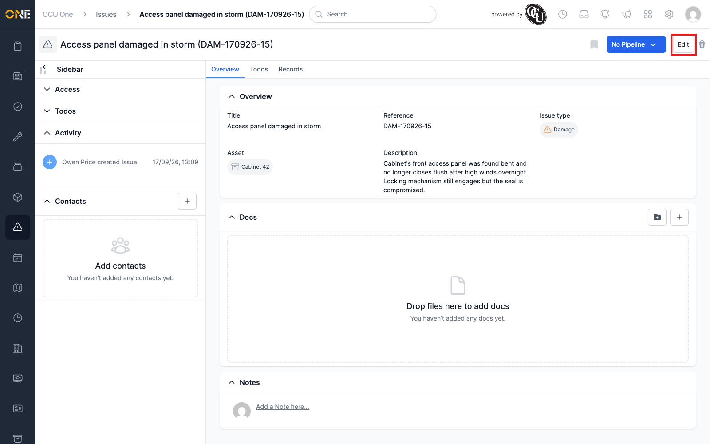
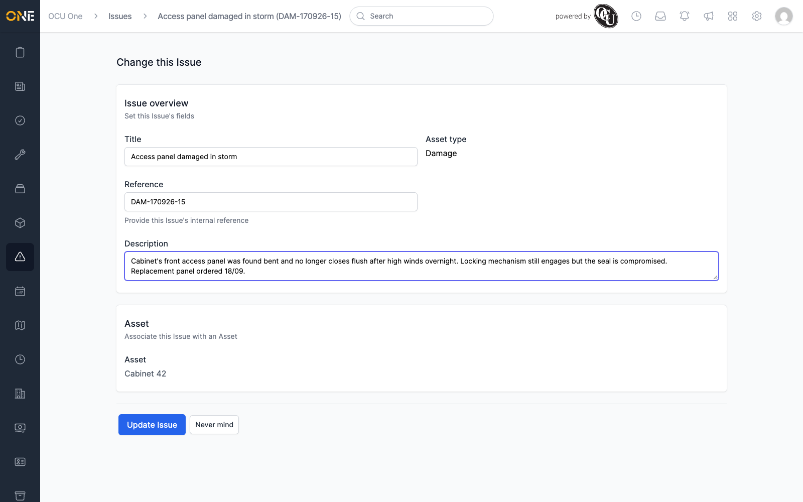
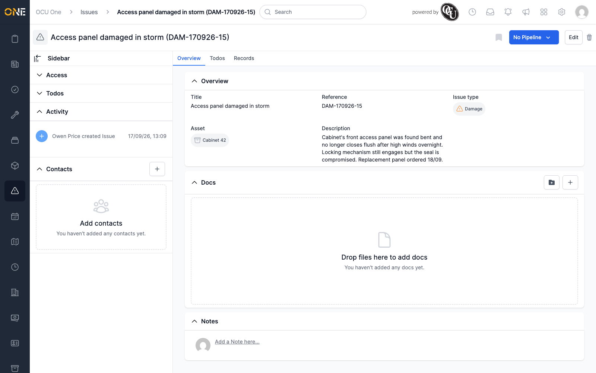
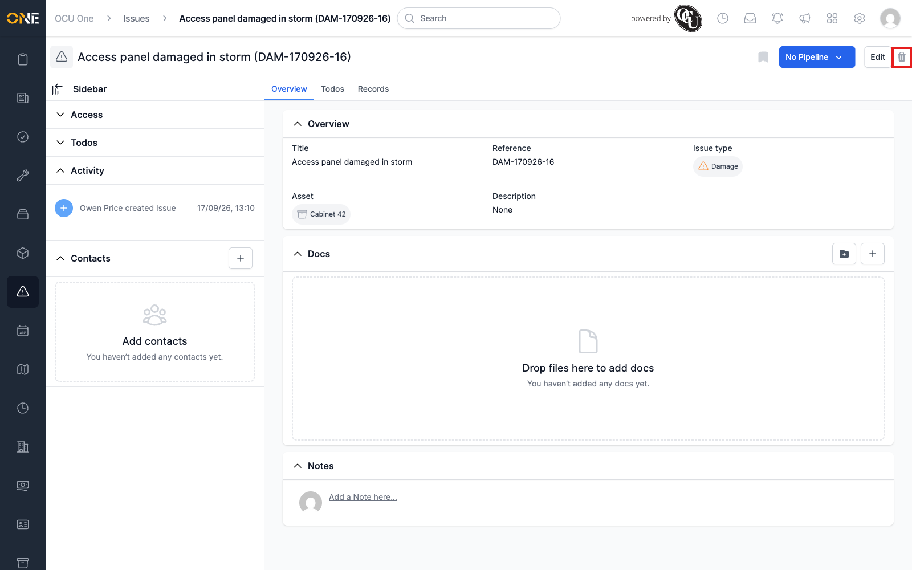
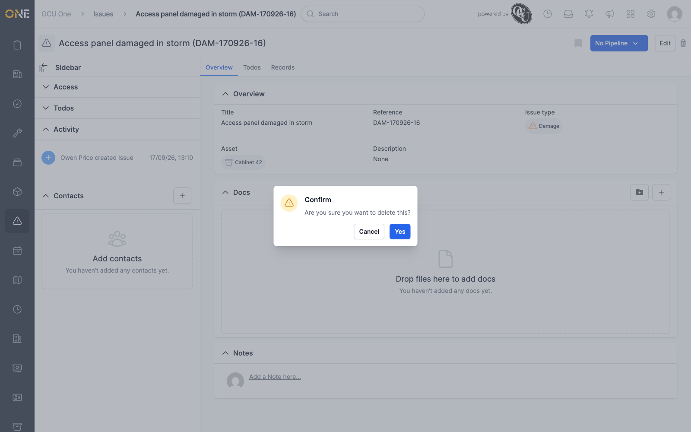
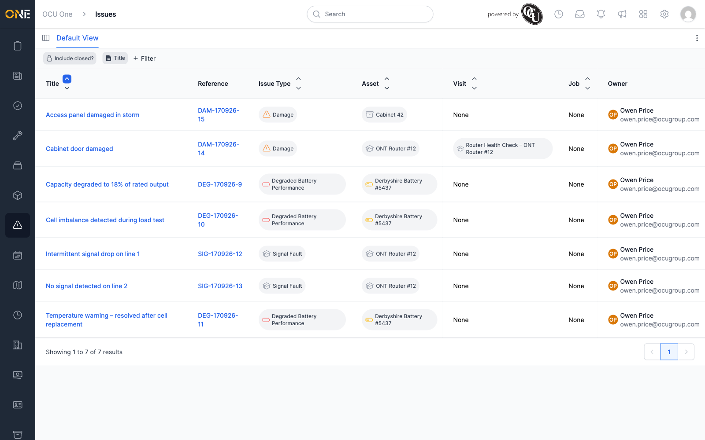

# Editing or deleting an issue

Once an issue has been raised, you can update its details or remove it
entirely from its own overview page.

## Editing an issue

Open the issue and click **Edit**, next to the pipeline stage button in
the top-right.

This opens the same form used when the issue was created — title,
reference, and description can all be changed. The issue type and the
asset or visit it's raised against can't be changed here.

Click **Update Issue** to save. The overview page reflects the change
immediately.

## Deleting an issue

Click the trash icon next to **Edit**.

A confirmation dialog appears — click **Yes** to confirm, or **Cancel** to
back out.

Once confirmed, you're taken back to the Issues list and the deleted
issue no longer appears in it.

