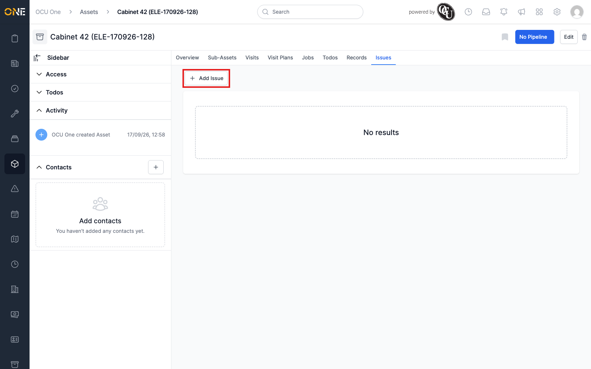
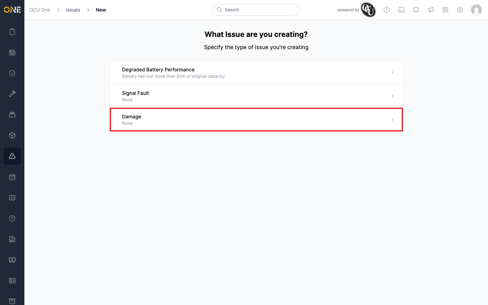
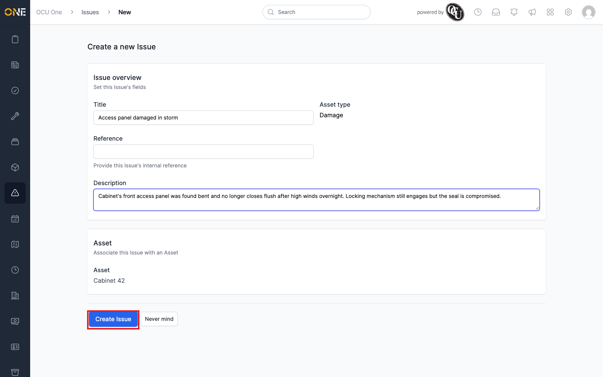
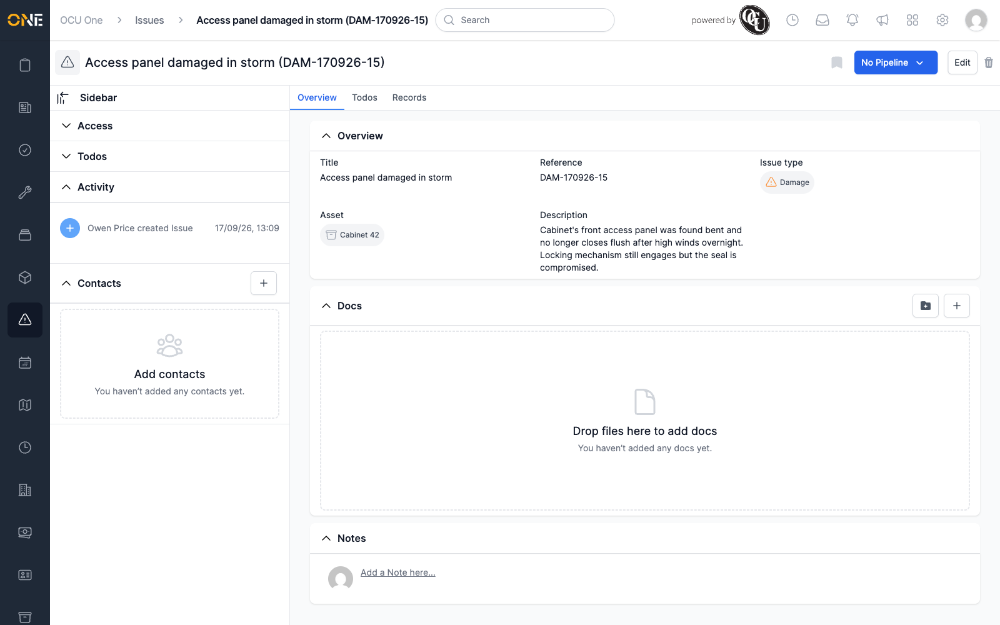

# Raising an issue

An issue is raised from the **Issues** tab on the specific asset or visit
it relates to, not from the Issues list itself.

## Starting a new issue

Open the asset (or visit) and go to its **Issues** tab. If there aren't
any issues yet, you'll see an **Add Issue** button.

Click it, and you're asked which type of issue you're raising — the types
available depend on what's been set up for your organisation.

## Filling in the details

Pick a type to open the new issue form. Fill in:

- **Title** — a short summary.
- **Reference** — an optional internal reference; leave blank to have one
  generated automatically.
- **Description** — as much detail as you have.

The **Asset type** and the **Asset** (or **Visit**) it was raised against
are shown for confirmation and can't be changed here.

Click **Create Issue** to save it, or **Never mind** to cancel.

## After it's created

The new issue opens straight to its own overview page, with an automatic
reference (here, "DAM-170926-15") and an activity entry recording who
raised it and when.

From here you can edit it, attach docs, add notes, or move it through a
pipeline — see
[Editing or deleting an issue](Editing%20or%20deleting%20an%20issue.md) and
[Resolving an issue (moving through pipeline stages)](Resolving%20an%20issue%20%28moving%20through%20pipeline%20stages%29.md).
