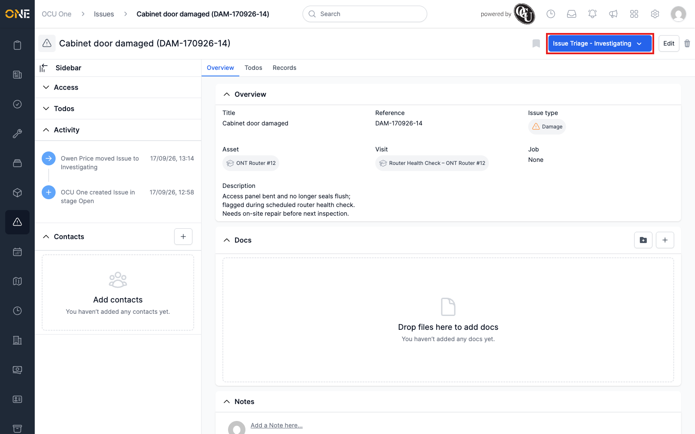
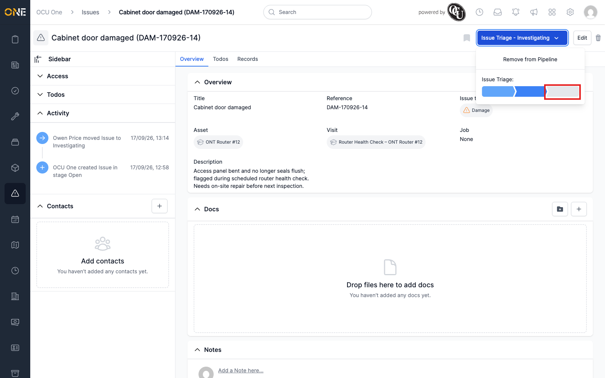
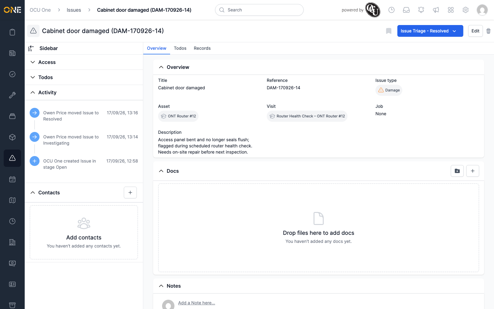
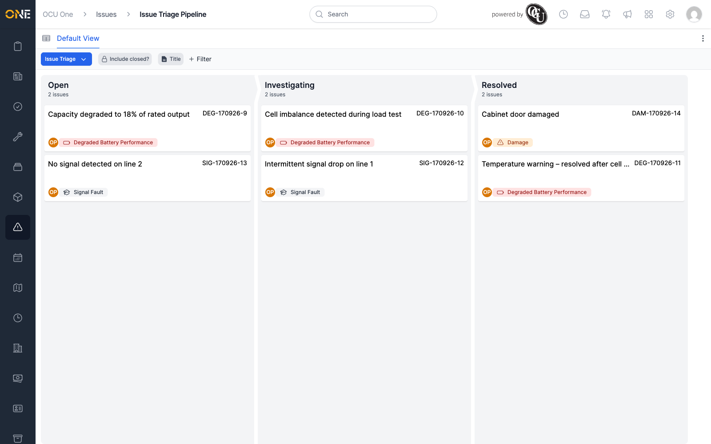

# Resolving an issue (moving through pipeline stages)

If issues are tracked through a pipeline, an issue moves through named
stages — for example Open, Investigating, and Resolved — as work on it
progresses.

## Moving an issue

On the issue's overview page, click the pipeline button in the top-right
(it shows the pipeline name and the issue's current stage, e.g. "Issue
Triage - Investigating").

A dropdown opens showing the pipeline's stages as a segmented bar — filled
segments are stages already passed through, and you can click any segment
to jump straight to that stage.

Click the segment for the stage you want — here, **Resolved**.

## After resolving

The button updates immediately to show the new stage, and the sidebar's
**Activity** feed records the move, alongside every earlier stage change.

An issue in a **closed** stage (like Resolved) drops off the default
Issues list and board view unless **Include closed?** is switched on — see
[Browsing issues](Browsing%20issues.md). The board itself now shows the
issue in its new column.

