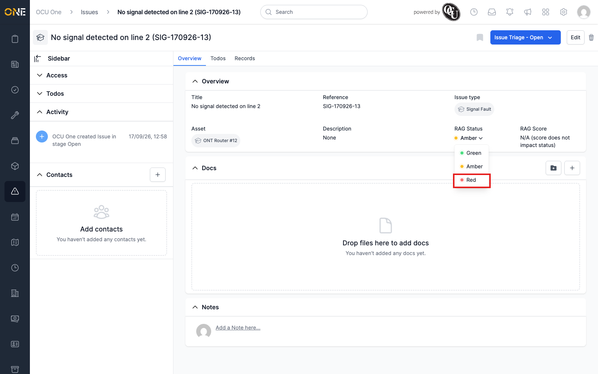
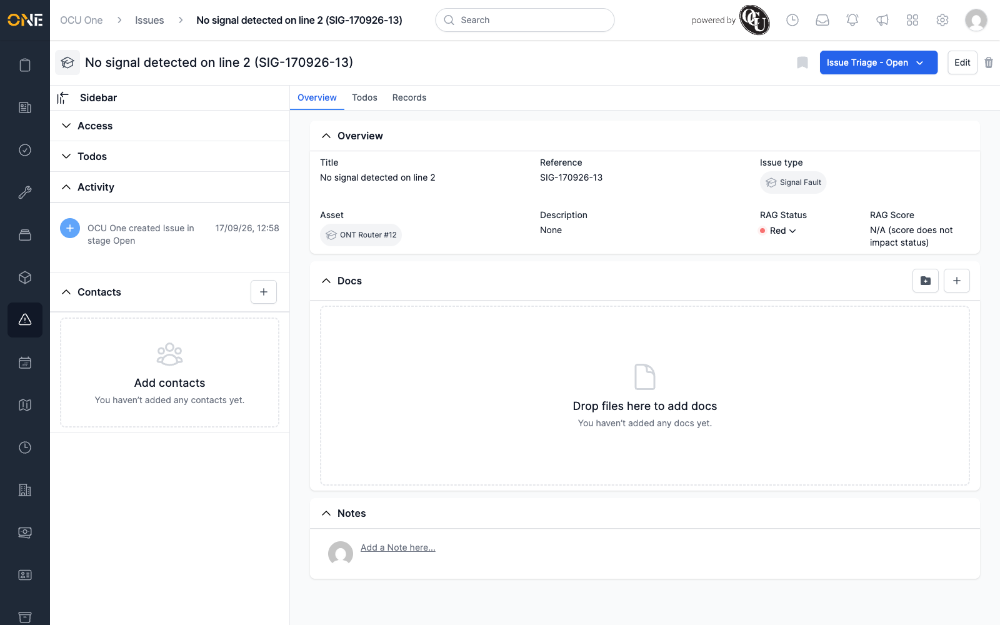

# Updating an issue's RAG status

Where an issue's type has RAG (Red/Amber/Green) tracking turned on, its
Overview tab shows a **RAG Status** and **RAG Score** alongside its other
fields.

## Where to find it

Look for **RAG Status** among the issue's main details, shown as a
coloured dot and label with a dropdown arrow.

*RAG Score reads "N/A (score does not impact status)" here, since this
issue type doesn't use automatic scoring.*

## Changing it

Click the RAG Status label to open the dropdown of Green / Amber / Red.

Pick whichever reflects the issue right now — for example, **Red**.

The field on screen doesn't update straight away — it keeps showing the
previous colour and label. Reload the page to see the change take effect.

## Things to know

- The RAG Status field only appears at all if the issue's **Issue Type**
  has RAG tracking enabled — set up in Settings, not something you can
  turn on from the issue itself.
- RAG status is a manual judgement call unless the issue type has
  automatic scoring configured, in which case the score drives the colour
  instead.
