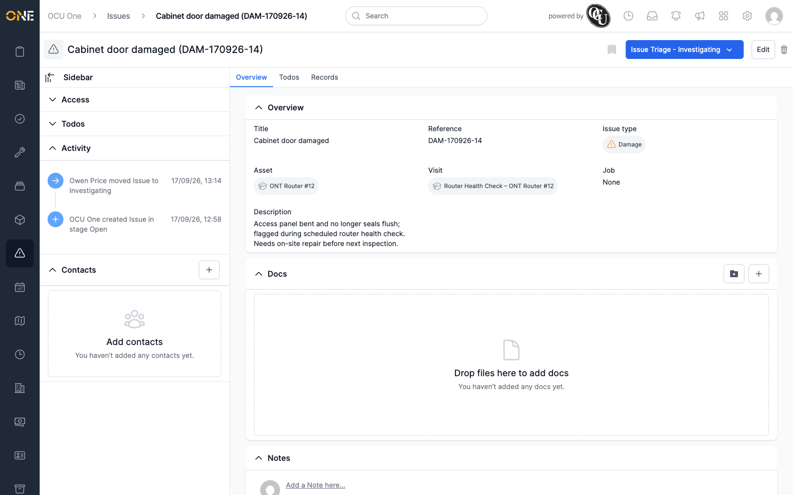

# Viewing an issue's overview page

Opening an issue lands you on its Overview tab — everything about that
issue in one place.

## The Overview tab

The main panel shows:

- **Title** and **Reference**.
- **Issue type**.
- **Asset** — the asset the issue is against, or was raised via if it came
  from a visit.
- **Visit** and **Job** — shown only when the issue was raised against a
  visit rather than an asset directly.
- **Description**.
- **RAG Status** and **RAG Score**, if the issue's type tracks RAG (see
  [Updating an issue's RAG status](Updating%20an%20issue's%20RAG%20status.md)).

The **Issue Triage** button in the top-right shows and lets you change the
issue's current pipeline stage — see
[Resolving an issue (moving through pipeline stages)](Resolving%20an%20issue%20%28moving%20through%20pipeline%20stages%29.md).

Below the main fields, **Docs** and **Notes** sections let you attach
files and leave comments directly on the issue.

## The sidebar

Expand **Access** to see and change who owns the issue and whether it's
shared. **Todos** gives a running count of outstanding to-dos without
opening the Todos tab — see
[Viewing an issue's to-dos](Viewing%20an%20issue's%20to-dos.md). **Activity**
lists every change made to the issue, in order — created, moved between
stages, and so on — with who made it and when.

## Other tabs

**Todos** and **Records** sit alongside Overview at the top of the page —
see [Viewing an issue's to-dos](Viewing%20an%20issue's%20to-dos.md) and
[Viewing an issue's records](Viewing%20an%20issue's%20records.md).
